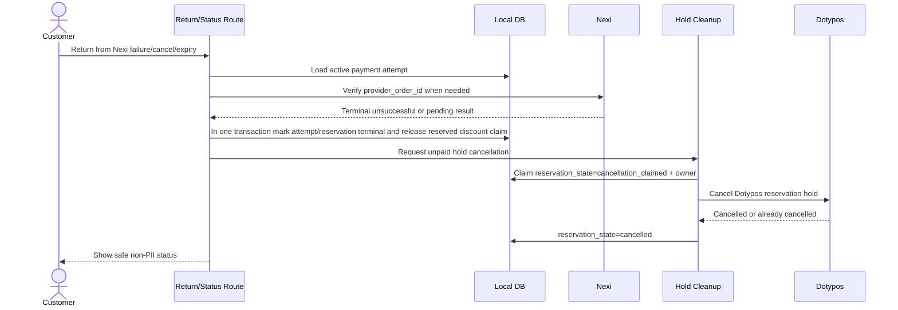
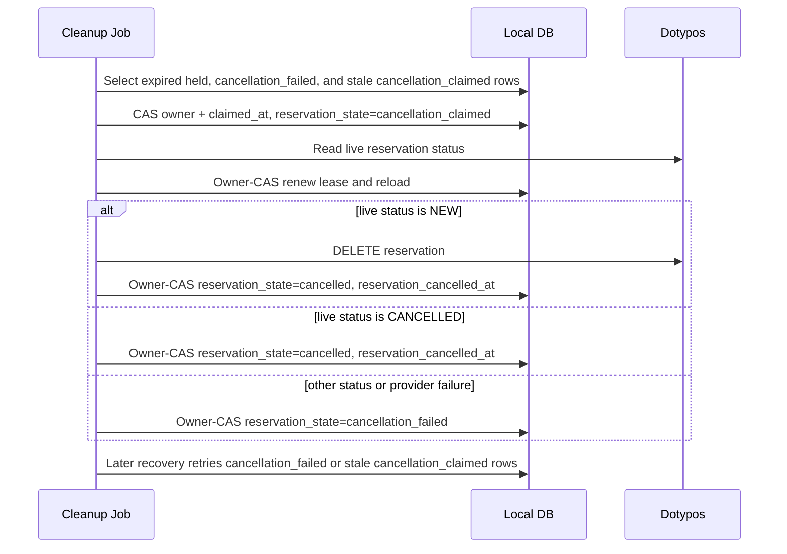

# Workspace Checkout Lifecycle

This document is the Phase 1 contract for the Workspace checkout database rewrite. It supersedes the earlier `payment_orders`-centered model for new implementation work.

The local database is a Deskohub workflow, payment, legal, and recovery ledger. Dotypos remains the source of truth for customer facts and reservation facts. Nexi remains the source of truth for payment processing facts. The local database must not become a customer profile store, a reservation fact store, a raw provider payload archive, or a return-state token store.

## Core lifecycle tables

The core checkout lifecycle uses these tables:

- `workspace_reservations`
- `payment_attempts`
- `webhook_events`
- `legal_evidence_events`

Do not recreate `checkout_return_state_tokens` as a state table. Return pages must derive enough context from signed URL state, route parameters, Nexi verification, and the durable rows above.

Discount configuration and audit history extend this lifecycle through `discounts`, `discount_product_targets`, `discount_codes`, `discount_code_customers`, `discount_applications`, and `discount_code_redemptions`. These tables store only source-neutral benefit configuration, Dotypos customer IDs, generic application snapshots, and claim state. They must not store customer contact data, Workspace access codes, or raw provider payloads. See [Workspace discount-code operations](./discount-codes.md).

## Advertised, quoted, and payable prices

Checkout has three distinct price boundaries:

1. The reservation page advertises a price.
2. Reservation submission creates the order-summary quote that the customer reviews.
3. Order submission freshly affirms that signed summary before payment begins.

The server must issue an integrity-protected advertisement snapshot for the product and reservation inputs whose price is visible on the reservation page. Reservation-page advertisement evaluates only automatic discounts that can be discovered without customer identity; currently this means Calendar sales. It must not resolve or create a Dotypos customer merely to advertise a price. Customer-specific pricing is outside the advertisement boundary by contract and does not need an inert marker in the snapshot. The snapshot contains no customer PII and is carried back by the reservation form without treating client-authored price data as authoritative. The signed order-summary state performs the same role for the price reviewed on the summary page.

On reservation submission, the server opens the advertisement snapshot and freshly affirms only the anonymously discoverable automatic discounts that were advertised. A Calendar sale that became available after the snapshot was issued is not added retrospectively. After that boundary is affirmed, the normal reservation workflow resolves or creates the Dotypos customer and evaluates the customer discount for the first signed order summary. Because customer-specific pricing could not be evaluated at the anonymous advertisement boundary, that customer discount may first appear on the summary without producing `pricing_changed`. This is an explicit boundary contract, not a general permission to introduce later automatic discounts.

Once a customer discount has appeared in a signed summary, it is an accepted discount like any other: code submission must affirm it before changing the summary, final order submission must freshly affirm it, and its disappearance or change produces the normal `pricing_changed` result. No later workflow may use the anonymous-advertisement exception to replace, add, or silently remove a customer discount that the customer has already seen.

`pricing_changed` is a normal workflow result at both transitions, not an exceptional checkout failure:

- If anonymous discount discovery fails before the reservation page is rendered, log the error, omit that discount from the advertisement, and continue without it. Quote generation must not add an anonymously discoverable automatic discount that becomes available after the advertisement snapshot was issued.
- If a discount in the advertisement snapshot cannot be included when reservation submission creates the quote, create the current quote without that discount and return `pricing_changed` for every affected summary product key, such as `product:cowork:basic`. The customer must review the changed summary before payment can be requested.
- If a discount in the signed summary cannot be freshly affirmed at order submission, return `pricing_changed` with a refreshed signed summary. Create no durable payment attempt and no external payment session.
- Newly available anonymously discoverable automatic discounts are never introduced retrospectively during quote generation or final affirmation. They may appear only through a new advertisement/summary cycle. The customer discount may first appear only at the first signed-summary boundary after Dotypos identity resolution, as described above. A successfully submitted discount code is a separate deliberate exception because the customer explicitly requested that quote change.

Discount code entry belongs on the order-summary page as an independent form with its own server action, pending state, and field error. It must not resubmit the reservation form or the main order submission:

- The action receives the current signed summary and submitted code.
- It first affirms every discount already displayed. If any changed, it returns the normal `pricing_changed` result and a refreshed signed summary.
- An unavailable or invalid code returns a field-level error and leaves the existing signed summary payable. It never blocks proceeding without the code.
- A valid code returns a new signed summary containing the code discount. It does not create a payment attempt, persist an application, or reserve code capacity.
- Once present in the signed summary, a code follows the same final affirmation and payment-lifecycle rules as every other discount.

The hard payment invariant is that a provider session amount must exactly equal the last signed summary price shown to the customer. Order submission freshly affirms exactly the discounts in that summary and compares the complete quote fingerprint and total. A mismatch—or a failure to persist applications or admit a claim atomically—returns `pricing_changed`; the transaction rolls back and Nexi is not called.

Advertised, signed, and freshly affirmed quotes and local payment attempts always retain the catalog currency. The controlled non-production Nexi sandbox currency override is a provider-adapter exception only: Workspace applies it immediately before HPP creation and again when constructing Nexi verification arguments. The override never changes locally persisted payment facts, the customer-visible quote, its numeric minor-unit value, or its exponent, and it is unavailable for production or the live Nexi origin.

## Ownership

| Data | Owner | Local DB contract |
| --- | --- | --- |
| Customer name, email, phone | Dotypos customer | Store only `dotypos_customer_id`. Never store as columns, JSON, event text, or raw payload. |
| Dotypos reservation date, service options, staff note, reservation status | Dotypos reservation | Store `dotypos_reservation_id` and local workflow timestamps/states only. Read Dotypos when reservation facts are needed. |
| Checkout session and attempt idempotency | Deskohub workflow | Store only the HMAC session and attempt keys. The object payloads used to derive them are transient and must not be persisted. |
| Payment session and terminal state | Nexi plus Deskohub workflow | Store payment attempts, Nexi order IDs, non-PII security tokens, operation IDs/statuses, redirect URL if needed for retry support, and local payment state. |
| Nexi webhooks | Nexi plus Deskohub workflow | Store dedupe identity and normalized processing state. Never store raw notification bodies or optional sensitive provider fields. |
| Legal acceptance | Deskohub legal evidence | Store document keys, paths, hashes, acceptance booleans, timestamps, locale, source, and idempotency keys. Never store rendered legal documents or customer contact data. |

## No-PII Policy

No customer PII may be persisted in database columns, JSON, text messages, or event metadata. This includes customer name, email, phone number, payment instrument data, Nexi `customerInfo`, raw provider payloads, and free-form user notes.

Allowed local values:

- Dotypos customer IDs and reservation IDs.
- Deskohub IDs, correlation IDs, HMAC checkout session and attempt keys, payment attempt IDs, webhook event IDs, and provider operation IDs.
- Nexi `securityToken`, because it is short-lived non-PII and needed for payment-attempt safety.
- Legal document paths and hashes.
- Local state enums, timestamps, and normalized failure codes.
- Payment amounts, currencies, quote fingerprints, and product price metadata needed to verify a Nexi result, provided they do not include customer or reservation facts that Dotypos owns.

Enforcement boundary:

- Server actions may hold customer PII in memory only long enough to find or create the Dotypos customer and derive the transient checkout-key payloads.
- Repository inputs must be shaped so PII has no destination field.
- `jsonb` columns must use schemas that exclude customer contact fields, free-form customer notes, raw provider envelopes, and raw Dotypos responses.
- Logs may contain PII only under the application's global filtering policy.
- Any future column or JSON field that can carry customer-authored free text is forbidden unless a separate privacy review explicitly reclassifies it.

## Table Contracts

### `workspace_reservations`

One row per Deskohub checkout workflow for a Dotypos reservation hold and its payment lifecycle.

| Column | Type | Required | Purpose |
| --- | --- | --- | --- |
| `id` | text | yes | Local workflow ID. Stable route/support reference. |
| `checkout_session_key` | text | yes | HMAC key grouping deliberate reservation submissions while the customer moves between Reservation and Pay. Stores only the digest. |
| `checkout_attempt_key` | text | yes | HMAC idempotency key for one mounted-form submission and its immediate retry. Includes the normalized reservation details and stores only the digest. |
| `correlation_id` | text | yes | Non-PII cross-system tracing ID. Unique. |
| `dotypos_customer_id` | text | yes | Dotypos customer that owns customer PII. |
| `dotypos_reservation_id` | text | no | Dotypos reservation hold/final reservation ID. Null until Dotypos creates it. |
| `reservation_state` | text enum | yes | Local reservation workflow state. |
| `payment_state` | text enum | yes | Aggregate payment state across attempts. |
| `fulfillment_state` | text enum | yes | Local post-payment/legal-delivery workflow state. |
| `active_payment_attempt_id` | text | no | Current payment attempt, if a Nexi session exists. |
| `reservation_hold_expires_at` | timestamptz | no | Local hold deadline used for cleanup scheduling. Mirrors Deskohub hold policy, not Dotypos facts. |
| `reservation_hold_expired_at` | timestamptz | no | When local cleanup observed the hold as expired. |
| `reservation_created_at` | timestamptz | no | When Dotypos reservation creation succeeded. |
| `reservation_confirmed_at` | timestamptz | no | When paid workflow confirmed the Dotypos reservation. |
| `reservation_cancelled_at` | timestamptz | no | When Dotypos cancellation succeeded or Dotypos already reported cancellation. |
| `cancellation_claim_owner` | text | no | Opaque per-worker cancellation owner. Paired with `cancellation_claimed_at`; ownerless legacy rows remain valid during rollout. |
| `cancellation_claimed_at` | timestamptz | no | Database-clock start or renewal time of the current cancellation lease. |
| `cancellation_failure_disposition` | text | no | `retryable` for automatic recovery or `manual_review` for an excluded poison row. |
| `cancellation_retry_at` | timestamptz | no | Database-clock retry eligibility time; required only for retryable cancellation failures. |
| `cancellation_recovery_reason` | text | no | Audit reason for the current cancellation path: genuine hold expiry, attachment compensation, supersession recovery, retryable failure, or stale-claim recovery. |
| `paid_at` | timestamptz | no | When a verified Nexi attempt made the workflow paid. |
| `fulfilled_at` | timestamptz | no | When all required post-payment work completed. |
| `fulfillment_failed_at` | timestamptz | no | Most recent fulfillment failure time. |
| `failure_code` | text | no | Normalized non-PII workflow failure code. |
| `fulfillment_failure_code` | text | no | Normalized non-PII fulfillment failure code. |
| `created_at` | timestamptz | yes | DB-managed creation timestamp. |
| `updated_at` | timestamptz | yes | DB-managed update timestamp. |

Indexes and constraints:

- Primary key on `id`.
- Unique index on `checkout_attempt_key`.
- Partial unique index on `checkout_session_key` while `reservation_state <> 'cancelled'`.
- Lookup index on `(checkout_session_key, created_at)`.
- Unique index on `correlation_id`.
- Partial unique index on `dotypos_reservation_id` where not null.
- Partial index on `reservation_hold_expires_at` for `reservation_state = 'held'`.
- Partial cancellation recovery index on `(reservation_state, cancellation_recovery_reason, cancellation_failure_disposition, cancellation_retry_at, cancellation_claimed_at)` for legacy `cancelling`, owned `cancellation_claimed`, and `cancellation_failed`.
- Recovery index on `(reservation_state, payment_state, fulfillment_state)`.
- `dotypos_reservation_id` must be non-null for `held`, `confirming`, `confirmed`, `cancelling`, `cancellation_claimed`, `cancelled`, and `cancellation_failed` states.
- `paid_at` must be non-null when `payment_state = 'paid'`.
- `fulfilled_at` must be non-null when `fulfillment_state = 'fulfilled'`.
- `fulfillment_failed_at` and `fulfillment_failure_code` must be non-null when `fulfillment_state = 'failed'`.
- Cancellation claim owner and timestamp must both be null or both be present.
- Retryable cancellation failures require a retry timestamp; manual-review failures must not have one.
- Cancellation recovery reasons are restricted to the documented audit values. Only a genuine hold-expiry observation may write `reservation_hold_expired_at`; other recovery reasons never synthesize or overwrite it.

### `payment_attempts`

One row per Nexi HPP/session creation attempt. Retries create new attempts instead of overwriting prior attempt history.

| Column | Type | Required | Purpose |
| --- | --- | --- | --- |
| `id` | text | yes | Local payment attempt ID. |
| `workspace_reservation_id` | text | yes | Parent workflow row. |
| `provider` | text enum | yes | Initial value: `nexi`. |
| `provider_order_id` | text | yes | Nexi order ID, normally the value sent to `order.orderId`. Unique for Nexi. |
| `security_token` | text | no | Nexi HPP security token. Short-lived non-PII. |
| `state` | text enum | yes | Attempt-level payment state. |
| `amount_value` | integer | yes | Expected payment amount in scaled integer form. |
| `amount_exponent` | integer | yes | Currency exponent used for amount verification. |
| `currency` | text | yes | Uppercase ISO currency code. |
| `provider_redirect_url` | text | no | Nexi hosted page URL, if needed to resume redirect before expiry. |
| `last_webhook_event_id` | text | no | Last normalized webhook event applied to this attempt. |
| `last_provider_operation_id` | text | no | Last provider operation ID observed. |
| `last_provider_status` | text | no | Last normalized provider status observed. |
| `failure_code` | text | no | Normalized non-PII unsuccessful terminal code. |
| `created_at` | timestamptz | yes | DB-managed creation timestamp. |
| `updated_at` | timestamptz | yes | DB-managed update timestamp. |

Indexes and constraints:

- Primary key on `id`.
- Foreign key to `workspace_reservations(id)`.
- Unique index on `(provider, provider_order_id)`.
- Index on `workspace_reservation_id`.
- Recovery index on `(state, created_at)`.
- `provider = 'nexi'` for the initial implementation.
- `amount_exponent` must be between `0` and `20`.
- `currency` must be uppercase three-letter text.
- `failure_code` must be non-null for failed/cancelled/expired terminal states.

### `webhook_events`

One row per Nexi webhook event identity for dedupe and normalized processing status.

| Column | Type | Required | Purpose |
| --- | --- | --- | --- |
| `id` | text | yes | Local webhook row ID. |
| `provider` | text enum | yes | Initial value: `nexi`. |
| `event_id` | text | yes | Provider event ID or deterministic identity derived from non-secret official fields. Unique. |
| `payment_attempt_id` | text | no | Associated payment attempt when known. |
| `provider_order_id` | text | no | Non-PII provider order ID from `operation.orderId`, for lookup before attempt association. |
| `received_at` | timestamptz | yes | When the webhook was received. |
| `processed_at` | timestamptz | no | When processing completed successfully. |
| `state` | text enum | yes | Webhook processing state. |
| `error_code` | text | no | Normalized non-PII processing error code. |
| `created_at` | timestamptz | yes | DB-managed creation timestamp. |
| `updated_at` | timestamptz | yes | DB-managed update timestamp. |

No raw notification payload, `securityToken`, `customerInfo`, warnings, `additionalData`, card data, or provider response body may be stored.

### `legal_evidence_events`

Append-only legal acceptance/rejection evidence. Legal hashes may also be used during workflow decisions, but this table is the durable legal event stream.

| Column | Type | Required | Purpose |
| --- | --- | --- | --- |
| `id` | text | yes | Local legal evidence event ID. |
| `workspace_reservation_id` | text | no | Associated workflow row when known. |
| `idempotency_key` | text | yes | Submit HMAC or other non-PII dedupe key. |
| `document_key` | text | yes | Stable internal document key. |
| `document_path` | text | yes | Path of accepted document version. |
| `document_hash` | text | yes | SHA-256 hash of accepted/rejected document. |
| `hash_algorithm` | text enum | yes | Initial value: `sha256`. |
| `accepted` | boolean | yes | Whether the customer accepted this document/acknowledgement. |
| `accepted_at` | timestamptz | yes | Server timestamp for the acceptance decision. |
| `locale` | text | yes | Locale of the legal document shown. |
| `source` | text | yes | Normalized source, for example `reservation_submit`, `retry_submit`, or `migration_backfill`. |
| `created_at` | timestamptz | yes | DB-managed creation timestamp. |

Indexes and constraints:

- Primary key on `id`.
- Index on `workspace_reservation_id`.
- Index on `(idempotency_key, document_hash)`.
- `hash_algorithm = 'sha256'`.
- No rendered document bodies or PII-bearing consent payloads.

## Lifecycle Enums

### Reservation State

- `draft`: local workflow exists before Dotypos hold creation is claimed.
- `creating_hold`: a worker has claimed Dotypos reservation hold creation.
- `held`: Dotypos has a `NEW` hold and local payment may proceed.
- `hold_expired`: local policy observed the hold deadline before payment completed.
- `confirming`: payment is verified paid and a worker is confirming/finalizing the Dotypos reservation.
- `confirmed`: Dotypos reservation is confirmed/final for the paid booking.
- `cancelling`: a legacy worker attempted an ownerless cancellation; after the ownership migration the compatibility trigger immediately hands it off as retryable work.
- `cancellation_claimed`: an ownership-aware worker exclusively owns the cancellation provider boundary.
- `cancelled`: Dotypos hold was cancelled or Dotypos already reports it as cancelled.
- `cancellation_failed`: cancellation failed and needs retry/manual recovery.

Allowed reservation transitions:

- `draft -> creating_hold -> held`
- `creating_hold -> cancellation_failed` when the hold is created in Dotypos but local attachment fails. The failed attachment is queued immediately for owned cancellation compensation.
- `creating_hold -> draft` only when Dotypos hold creation failed before any Dotypos reservation ID existed.
- `held -> confirming -> confirmed` after verified paid payment.
- `held -> hold_expired -> cancellation_claimed -> cancelled` for unpaid expired holds.
- `held -> cancellation_claimed -> cancelled` for unsuccessful terminal payment before hold expiry.
- `cancellation_claimed -> cancellation_failed`
- `cancellation_failed -> cancellation_claimed -> cancelled`
- `held|hold_expired|cancellation_failed -> cancelling -> cancellation_failed` is the database-owned fail-closed handoff for old writers.

Forbidden reservation transitions:

- Any transition from `cancelled` or `confirmed` without an explicit manual repair path.
- Any creation of a second Dotypos reservation for the same `checkout_attempt_key`.
- Any creation of a replacement Dotypos reservation in the same checkout session before the prior local and Dotypos reservations are cancelled.
- Any cancellation finalization unless the row is still in `cancellation_claimed`, owned by the completing worker, unpaid, and unconfirmed.
- Any Dotypos cancellation DELETE unless the worker has reloaded and renewed the row after the live provider-status read and still owns its current cancellation claim.

### Cancellation ownership and live provider status

Cancellation is a compare-and-set lease, not ownership inferred from a legacy state. An ownership-aware worker atomically writes a fresh opaque owner and database-generated `cancellation_claimed_at` while moving an eligible row to `cancellation_claimed`. The database constraint makes that state equivalent to a complete owner/timestamp pair and forbids owner fields on every other state. Every completion, failure, supersession transaction, and ownership renewal compares that same owner. After reading live provider status, the worker renews the timestamp with an owner-CAS update and uses the returned row as its reload. A worker whose renewal no longer finds its owner stops without provider or local destructive work.

The lease is five minutes. Acquisition, renewal, retry eligibility, and stale takeover compare against the database clock so application-host clock skew cannot shorten or extend ownership. `cancellation_claimed` may be taken over only when its paired lease timestamp is at or before the database's five-minute stale cutoff. During rollout, the database trigger rewrites every ownerless old-writer `cancelling` write before `RETURNING` into due retryable `cancellation_failed` work. The old worker therefore fails its own `state === cancelling` provider-boundary guard, while an ownership-aware worker can claim the durable handoff. Retryable failures carry a database-generated retry time; failures that require manual review carry no retry time and are excluded from bounded cron batches. Queue delivery is the primary cleanup path; the daily cron selects expired held rows, due retryable failures, legacy recoverable rows, and only stale owned leases.

Cancellation recovery carries an explicit reason through queue, cron, service, and repository calls. `reservation_hold_expired_at` is written only when an unpaid held reservation's real deadline was observed at or before the cleanup timestamp. Attachment compensation, supersession recovery, retryable failures, and stale-claim takeover never synthesize that audit fact.

After Dotypos creates a reservation, a failed local attachment hands the exact Dotypos reservation ID to two independent durable recovery paths: the local cancellation marker and an identity-bearing queue message retained for the queue provider's seven-day maximum. Both are attempted even if the other fails. A surviving marker is recoverable by cron when enqueue fails; a surviving queue message can idempotently materialize the marker when the original marker write fails. Duplicate or delayed messages only materialize the original `creating_hold`/initial attachment-failure state with the same provider ID and cannot overwrite a successfully attached, differently owned, retried, manually reviewed, or completed reservation. If neither durable handoff succeeds, the action fails loudly rather than reporting a successful handoff.

A legacy `cancelling`, owned `cancellation_claimed`, or `cancellation_failed` row with `payment_state = 'pending'` is never sent directly to cancellation. Recovery first CAS-restores a stale/unowned row to `held`, allowing the existing provider-payment finalization contract to resolve paid, terminal, or still-pending outcomes. Paid stays held for fulfillment, terminal unsuccessful can proceed through a fresh cancellation claim, and unconfirmed outcomes remain held for later reconciliation.

The live Dotypos policy has one shared matrix:

| Fresh Dotypos status | Cancellation action |
| --- | --- |
| `NEW` | Reload and renew local ownership, then issue DELETE. |
| `CANCELLED` | Reload and renew local ownership, then complete the local cancellation without DELETE. |
| Every other live status | Refuse DELETE and record an owned manual-review failure that cron does not repeatedly retry. |

The provider read and DELETE cannot be made atomic across Deskohub and Dotypos. A Dotypos reservation can change after the fresh status read and before DELETE; this is the unavoidable provider read/delete TOCTOU. Keeping the interval short, reloading and renewing current local ownership after the read, and refusing every freshly observed status other than `NEW` bound what Deskohub can control. Dotypos must remain authoritative if this race is observed.

### Payment State

Aggregate `workspace_reservations.payment_state` values:

- `not_started`: no active Nexi session exists.
- `pending`: at least one Nexi attempt is awaiting a terminal result.
- `paid`: Nexi verification confirmed successful payment.
- `failed`: Nexi verification returned payment failure.
- `cancelled`: Nexi/customer cancelled payment.
- `expired`: Nexi/session/hold expiry ended the payment workflow.

Attempt-level `payment_attempts.state` values:

- `created`: local attempt exists before HPP session details are attached.
- `pending`: customer can be redirected to Nexi or Nexi is processing.
- `paid`: verified terminal successful attempt.
- `failed`: verified terminal failed attempt.
- `cancelled`: verified terminal cancellation.
- `expired`: verified terminal expiry or local attempt expiry.

Allowed payment transitions:

- Reservation aggregate: `not_started -> pending -> paid`.
- Reservation aggregate: `not_started -> pending -> failed|cancelled|expired`.
- Attempt: `created -> pending -> paid|failed|cancelled|expired`.
- Terminal aggregate updates require the active payment attempt ID and only apply while the aggregate state is still `pending` on a held reservation.
- Attempt terminal updates only apply from non-terminal attempt states; `paid` can only be set from `pending`.
- Webhook terminal updates must update the attempt row and reservation aggregate in one database transaction. Provider retries may reapply a matching terminal attempt/reservation pair as an idempotent no-op, but must not mark one side terminal when the other side fails its guard.
- Discount application persistence and code-claim admission belong to the payment-attempt creation transaction. Claim redemption belongs to the paid transaction, and claim release belongs to every failed, cancelled, or expired transaction. Any application, claim, redemption, or release error is fatal and rolls back the owning payment transition; it must never be converted to an empty discount result or `not_pending` state.
- Failed/cancelled/expired workflows may create a new `payment_attempts` row only when the reservation is still `held` and hold deadline is valid.
- `paid` is terminal for payment state.

### Fulfillment State

- `not_started`: no post-payment confirmation/delivery work has completed.
- `processing`: paid workflow is claimed by a fulfillment worker.
- `fulfilled`: Dotypos reservation confirmation and required access/internal notifications are complete.
- `failed`: payment succeeded but fulfillment needs retry or manual recovery.

Allowed fulfillment transitions:

- `not_started -> processing -> fulfilled`
- `not_started -> processing -> failed`
- `failed -> processing -> fulfilled`
- `processing -> failed`

Fulfillment is allowed only when `payment_state = 'paid'`.

## Checkout Session And Attempt HMACs

`checkoutSessionId` groups the reservation rows created while a customer moves back and forth between Reservation and Pay. It remains stable when the customer returns to the form and deliberately submits again. `checkoutAttemptId` identifies one mounted-form submission and its immediate transport retry; a changed form value or a new form mount creates a new attempt.

Only HMAC digests are stored in `workspace_reservations.checkout_session_key` and `workspace_reservations.checkout_attempt_key`. The opaque browser IDs are carried only in signed checkout state and action input. Both key payloads use `JSON.stringify` on a fixed object shape; do not sort keys or build a delimiter-joined tuple.

```ts
const checkoutSessionKey = hmac({
  checkoutSessionId,
});

const checkoutAttemptKey = hmac({
  checkoutSessionId,
  checkoutAttemptId,
  reservation: normalizedAttemptIdentity,
});
```

The normalized attempt identity is one complete fixed projection: normalized customer `name`, `email`, `phone`, and optional `message`, followed by an exhaustive family-owned reservation projection. Cowork attempts include `kind`, `date`, `entryTier`, `coffee`, and normalized `monitorOption`; meeting-room attempts include `kind`, normalized `startsAt`, and normalized `endsAt`. Absent and blank normalized messages project to `null`, as do unavailable cowork monitor options. A message-only edit therefore rotates the attempt and hold, while whitespace-only edits and other inputs that decode to the same normalized reservation produce exactly the same attempt HMAC. The projection's PII exists only in this transient HMAC payload.

An exact attempt-key match makes an immediate retry idempotent. After a supersession failure rotates the local checkout session to the attempt identity, later exact retries probe both the original and rotated attempt-key projections before consulting the current session row. They therefore rediscover the one persisted attempt independently of stale browser session state instead of forking a second row. Draft insertion returns one of four exhaustive acquisition tags: `created`, `existing_attempt`, `session_occupied`, or `conflict_unresolved`. A uniqueness conflict is followed by a definitive lookup of the persisted attempt row before the current session row; if an active-session row becomes cancelled during that lookup, insertion retries instead of fabricating a result. Those repository retries are themselves bounded, and exhaustion returns `conflict_unresolved` so the action produces the standard retryable-unavailable outcome without inventing a persisted row. An exact conflict row still in `creating_hold` or `cancelling` follows the same bounded wait and definitive requery as a pre-read row. The action then produces an exhaustive `ReservationPreparationDecision`: `create_hold` only after a successful draft-to-creating-hold CAS, or `reuse_hold` only after a definitive unexpired held row is observed. Direct settled-hold reuse and reuse after a lost concurrent claim share this same path. Quote evaluation and provider hold creation use the definitive row's `dotypos_customer_id`, which may differ from the transient customer resolution performed by a concurrent retry.

A newly claimed `creating_hold` row carries a local pre-provider marker with an immutable provider-creation epoch. An Effect finalizer releases only that exact marker back to `draft` on typed failure, defect, or interruption. Another live action cannot steal it: exact retries wait for the transition and only a bounded stale-marker CAS may recover abandoned pre-provider work. Deterministic request construction, validation, table assignment, and a minimum-validity authentication lease all complete before a separate epoch-bound CAS replaces the marker with a durable provider-reconciliation marker and enters the irreversible provider boundary. The actual send consumes that fixed lease and performs no refresh or other fallible authentication setup after the marker.

Dotypos reservation creation has no documented idempotency key, so the prepared operation sends exactly one POST for an epoch, uses manual redirect handling, and never applies the adapter's general network/5xx retry policy. A network ambiguity, provider defect, 3xx response, zero-or-multiple create response, successful response without an ID, or provider-boundary persistence ambiguity can never return that epoch to `draft` merely because no local provider ID is present. The controlled note carries exact whole-line order and epoch correlation plus an opaque SHA-256 request-evidence value covering the normalized provider request. A direct response must contain exactly one reservation and match its expected status, IDs, interval, seats, customer, table, complete note, and request evidence before it can be attached.

Exact retries search Dotypos by both controlled order and epoch markers and verify the request evidence and persisted customer ID before interpreting provider status. Thus an epoch-A cancellation or a visibility-delayed epoch-B create cannot release or authorize another create for B. Fresh provider-boundary work remains a live fence: concurrent exact retries wait instead of reconciling or attaching while the original single-send action is still within its bounded lease. After a verified response, the canonical provider ID and one millisecond-normalized creation timestamp are first persisted as an epoch-bound candidate marker. Attachment is a second exact CAS from that candidate to `held`, but retains the candidate marker as a non-payable settling fence with an immutable persisted stabilization deadline. The sealed checkout URL renders that exact state as a pending, payment-free page which refreshes the server boundary until stabilization completes; it never converts a temporary fence into a permanent invalid-payment result. Candidate stabilization uses a distinct queue idempotency identity, and the consumer independently enforces that deadline; an immediate ambiguity delivery therefore cannot finalize the fence early even when queue deduplication or redelivery ordering differs. A delayed recovery task requires exactly one verified `NEW` winner and permits other exact-epoch matches only when they are definitively verified `CANCELLED`. Before replacing the fence with the attached marker, it durably enqueues cleanup for the original hold deadline; if that already-due delivery arrives before the exact candidate CAS, it remains retryable rather than being acknowledged as skipped. Confirmed compensation releases only the matching candidate-compensation tuple. One verified `NEW` match attaches idempotently, including commit-then-error and same-ID concurrent-attach cases; one verified `CANCELLED` match permits only the exact epoch's guarded release. Every created, reused, or reconciled attachment, including an already-due hold, must successfully receive its idempotent scheduled cleanup task before checkout can be ready. Enqueue failure or timeout fails the action while retaining the payment fence, so an exact retry enqueues the same task without another provider create.

Reconciliation outcomes are durable and operationally explicit in the non-PII `failure_code`: `zero_matches`, `multiple_matches`, `missing_id`, `unsafe_status`, and `read_failed` retain the same epoch and never issue another create. Transient read/visibility failures are retried by every exact checkout retry. A repeated non-transient marker is the manual escalation contract: support resolves the provider side using only the Deskohub order/epoch correlation, without copying provider payloads locally, until exactly one verified safe result is observable; the normal exact-retry path then performs the epoch-bound attach or release. No database-only reset is permitted for an ambiguous epoch. A provider result already handed to compensation remains compensation-only: delayed `NEW` visibility cannot attach it, while verified `CANCELLED` evidence may release only that exact epoch.

If a verified direct result loses attachment to a different verified result from the same epoch, the winner remains immutable and an epoch-, loser-, original-timestamp-, and owner-bound orphan marker durably blocks checkout, ordinary due cleanup, and supersession. When the winner is still a candidate, every pending, owned, released, and completed loser transition also carries the winner's exact provider identity, creation timestamp, and original stabilization deadline. Resolving the loser restores that exact candidate fence rather than an attached/payable marker; payment remains blocked until the delayed full-cardinality verification completes. Even when the winner was already attached, browser and queue recovery may remove the loser fence only after a fresh post-compensation query proves exactly one valid live `NEW` winner matching the immutable local provider ID and proves every other exact-epoch result valid and `CANCELLED`. Missing or unsafe winner evidence and any additional live result remain retryable fences. Candidate registration atomically establishes the blocker when it observes a different attached winner, so the payment-attempt transaction cannot link through the conflict window. Any attachment error first hands off the same immutable epoch/provider/timestamp tuple before attempting a definitive reread. The queue safely classifies that outcome as the same attached hold, a different-provider loser, or an unattached provider result; it schedules cleanup for the same hold and never compensates it, establishes the orphan blocker before cancelling a different loser, or enters the existing guarded unattached-compensation flow. Marker persistence and queue enqueue execute as independent all-exit handoff attempts, including defects; readiness is prohibited, and failure is returned only when neither path retained the exact tuple. When candidate persistence fails but its candidate marker committed, browser recovery, queue redelivery, and the stale daily scan all use attach-only recovery for that exact epoch/provider/timestamp; they never issue another create or cancel the candidate winner, and attachment retains the original hold deadline plus its non-payable stabilization fence. When candidate persistence fails but the queue retains the tuple, the consumer may promote the matching plain epoch-compensation marker to exact provider/timestamp cancellation recovery; this transition is idempotent and never authorizes another provider create or a broad cancellation. When immediate compensation already cancelled the exact provider result and safely released the local row to `draft`, the queued ambiguity delivery re-proves the exact order, epoch, provider, customer, request evidence, and observed `CANCELLED` status before acknowledging; provider visibility delay remains retryable and never causes a second cancellation or create. Unattached and unclassified redelivery share one exact state machine. It restores a mutable cancellation-failure marker only under that guarded association; resumes typed-failure, defect, and interruption states; and acknowledges locally completed cancellation without another provider call.

The queue first establishes or confirms an exact durable marker, then claims it with bounded stale-owner takeover before applying the S5-01 live-status policy. A live owner causes message retry rather than acknowledgement. Before a different-provider cancellation crosses its non-idempotent boundary, the exact owned recovery moves from send-capable processing to verification-only ownership. Pre-boundary lookup, ownership, or phase-transition failure releases back to send-capable recovery. After the boundary is consumed, every unsuccessful exit, including typed failure, defect, interruption, stale visibility, and cardinality-proof failure, releases only to an exact awaiting-visibility marker. Redelivery may reclaim verification ownership but never sends cancellation again. Only a failed release leaves the owned processing or verifying marker for stale takeover. Completion still requires definitive loser `CANCELLED` status plus the full winner/cardinality proof, stores an exact resolved marker, and makes commit-then-error redelivery idempotent. If later paid or terminal lifecycle progression replaces that marker, at-least-once redelivery may acknowledge only after re-proving exact order, epoch, loser, customer, request evidence, and observed `CANCELLED` status; markerless redelivery never issues another cancellation. An exact retry revalidates unresolved recovery before preparation and the payable service revalidates it at both checkout admission reads. The payment-attempt transaction repeats the no-unresolved-recovery predicate and requires the persisted hold deadline to be strictly later than database `clock_timestamp()` in the same atomic held/unpaid link CAS. A concurrent blocker or deadline transition therefore rolls back the staged attempt before Nexi can be called. A persistent recovery blocker returns a bounded retryable preparation outcome instead of spinning in supersession. Delayed evidence or handoff from another epoch cannot write or clear the marker or mutate the winner. The integrated attachment-compensation payload retains the epoch, recovery kind, candidate provider identity, and provider-created timestamp while using S5-01's shared owner/lease and status-policy symbols.

An exact attempt-key match is permanent idempotency, not a request to rotate. The exact row may continue from `draft`, reuse only a definitive valid held/not-started row, or converge its in-flight provider reconciliation; reuse never rewrites reservation details before the definitive eligibility reread. An exact retry of a cancelled row or any payment-terminal/in-progress row returns unavailable and never derives a replacement session, acquires another draft, or sends another provider create. Only a genuinely different attempt may supersede the current session row. If that changed attempt encounters an older row that is still only `draft` or carries the pre-provider marker, it first atomically retires that exact attempt into a non-create-capable draft marker under no-provider/unpaid predicates. Only a successful retirement CAS permits session isolation; repeated CAS loss is bounded and returns retryable unavailable.

A new attempt in the same session does not mutate or reuse the existing Dotypos reservation: the server claims the previous unpaid hold for cancellation, verifies its live Dotypos status, cancels it when `NEW`, marks its local row cancelled, and creates a fresh local and Dotypos reservation. Repeated supersession-claim loss and repeated session-occupied acquisition conflicts are bounded; exhaustion returns the retryable unavailable result without unowned cancellation or provider creation. If the previous row has pending/paid payment, is no longer pending in Dotypos, or its Dotypos cancellation fails, the server leaves that row to its normal lifecycle and rotates to a fresh checkout session before creating the new reservation. Every created row keeps its original persisted cleanup deadline through attachment and exact retries; attachment never refreshes it. Every definitive ready path, including a lost creation CAS or an already-due reconciled hold, must successfully schedule that exact deadline before returning.

The daily recovery scan selects stale pre-attachment candidates, attached candidates, candidate-compensation tuples, and pending or stale-owned different-provider markers and re-enqueues their exact epoch/provider/timestamp payloads. A failed initial enqueue or absent browser retry therefore cannot abandon them.

## Sequence Diagrams

### Reservation Submit And Hold

```mermaid
sequenceDiagram
  actor Customer
  participant App as Workspace Server Action
  participant DB as Local DB
  participant Dotypos

  Customer->>App: Submit reservation/contact/legal form
  App->>App: Open anonymous advertised-price snapshot
  App->>App: Validate input and legal consent
  App->>App: Affirm only its advertised anonymous automatic discounts
  App->>App: Derive checkout session and attempt HMACs
  App->>Dotypos: Find or create customer using PII
  Dotypos-->>App: dotyposCustomerId
  alt same attempt is already held
    App->>DB: Resolve exact persisted attempt row
  else session has an earlier unpaid hold
    App->>DB: Claim earlier row for cancellation
    App->>Dotypos: Cancel earlier NEW reservation
    App->>DB: Mark earlier row cancelled and insert replacement draft
  else no current row in session
    App->>DB: Acquire tagged workspace_reservations draft
  end
  App->>DB: CAS draft to creating_hold or resolve settled held row
  App->>App: Decide create_hold or reuse_hold exhaustively
  App->>App: Evaluate quote using persisted dotyposCustomerId
  opt create_hold
    App->>Dotypos: Create NEW reservation hold
    Dotypos-->>App: dotyposReservationId
    App->>DB: Set reservation_state=held and hold deadline
  end
  App->>DB: Insert legal_evidence_events
  alt advertised price still matches
    App-->>Customer: Show signed order summary, which may first add the customer discount
  else advertised discount unavailable
    App-->>Customer: Show refreshed signed summary with pricing_changed affected product keys; customer discount may still first appear
  end
```

### Independent Discount Code Form

```mermaid
sequenceDiagram
  actor Customer
  participant Summary as Order Summary
  participant App as Workspace Server Action

  Customer->>Summary: Submit discount-code form
  Summary->>App: Current signed summary + submitted code
  App->>App: Affirm every displayed discount
  alt displayed price changed
    App-->>Summary: pricing_changed + refreshed signed summary
  else code unavailable
    App-->>Summary: Field error; retain current signed summary
  else code accepted
    App-->>Summary: New signed summary containing code discount
  end
```

### Payment Attempt And Nexi Redirect

```mermaid
sequenceDiagram
  actor Customer
  participant App as Workspace Server Action
  participant DB as Local DB
  participant Nexi

  Customer->>App: Request payment for held workflow
  App->>DB: Load held workspace_reservations row
  App->>App: Freshly affirm exactly the signed-summary discounts and total
  alt fingerprint, total, or claim admission changed
    App-->>Customer: pricing_changed + refreshed signed summary; no payment session
  else signed price affirmed
    App->>DB: In one transaction create/link attempt, persist discount applications, and reserve code claim
    App->>Nexi: POST /orders/hpp with the exact signed-summary amount
    Nexi-->>App: hostedPage and securityToken
    App->>DB: Store securityToken, redirect URL, attempt pending
    App-->>Customer: Redirect to hostedPage
  end
```

### Webhook Success And Dotypos Confirmation

```mermaid
sequenceDiagram
  participant Nexi
  participant Webhook as Webhook Route
  participant DB as Local DB
  participant Dotypos
  participant Fulfillment

  Nexi->>Webhook: Official notification envelope
  Webhook->>Webhook: Decode envelope; derive event identity
  Webhook->>DB: Insert webhook_events(received) or load duplicate state
  alt duplicate processed
    Webhook-->>Nexi: No-op success
  else duplicate failed/received or fresh event
  Webhook->>DB: Claim retry only if webhook_events is not processed
  Webhook->>DB: Load payment attempt by provider_order_id
  Webhook->>Webhook: Compare notification securityToken if present
  Webhook->>Nexi: GET /orders/{provider_order_id}
  Nexi-->>Webhook: Verified payment result
  Webhook->>DB: In one transaction mark attempt/reservation paid and redeem reserved discount claim
  Webhook->>DB: Claim fulfillment_state=processing and reservation_state=confirming
  Fulfillment->>Dotypos: Confirm/finalize reservation using dotyposReservationId
  Dotypos-->>Fulfillment: Confirmation success
  Fulfillment->>DB: reservation_state=confirmed, fulfillment_state=fulfilled
  Webhook->>DB: webhook_events processed
  end
```

### Nexi Failure, Cancel, Or Expired Return



### Expired Hold Cleanup And Cancellation Retry



## Recovery Rules

| Scenario | Query shape | Recovery action |
| --- | --- | --- |
| Held reservation without payment | `reservation_state = 'held' and payment_state = 'not_started'` | Allow payment attempt until hold expires. |
| Pending payment | `payment_state = 'pending'` plus active attempt | Wait for webhook, verify with Nexi, or show pending status. |
| Paid but not fulfilled | `payment_state = 'paid' and fulfillment_state in ('not_started', 'failed')` | Run fulfillment worker. |
| Fulfillment stuck | `payment_state = 'paid' and fulfillment_state = 'processing'` | Inspect staleness; retry only through guarded repair path. |
| Expired unpaid hold | `reservation_state = 'held' and payment_state <> 'paid' and reservation_hold_expires_at <= now()` | Cancel Dotypos hold. |
| Cancellation failed, retryable | `reservation_state = 'cancellation_failed' and cancellation_failure_disposition = 'retryable' and cancellation_retry_at <= now()` | Retry Dotypos cancellation. |
| Cancellation failed, manual review | `reservation_state = 'cancellation_failed' and cancellation_failure_disposition = 'manual_review'` | Exclude from automatic batches and investigate explicitly. |
| Cancellation worker stopped | `reservation_state = 'cancellation_claimed'` with a stale paired claim | Take over with a new owner after the bounded five-minute database-clock lease. |
| Legacy cancellation handoff | An old writer attempts `reservation_state = 'cancelling'` | The compatibility trigger rewrites it to due retryable `cancellation_failed`; only an ownership-aware worker can claim the provider boundary. |
| Legacy cancellation with pending payment | `reservation_state in ('cancelling', 'cancellation_claimed', 'cancellation_failed') and payment_state = 'pending'` | After the ownership/lease guard, restore to `held` and run provider-payment reconciliation before considering cancellation. |
| Duplicate webhook | Existing `webhook_events.event_id` | Return duplicate/accepted response without reapplying side effects. |
| Legal rejection | `legal_evidence_events.accepted = false` | Do not create hold/payment; show legal consent error. |

Rollout is expand-first but is not zero-drain at the irreversible provider boundary. Before applying the migration, quiesce queue, cron, and supersession cancellation ingress and drain or terminate every old-version invocation; SQL cannot revoke provider permission already loaded into an old process. The migration then adds the ownership columns and `cancellation_claimed` state, converts already owner-stamped preview rows, hands every ownerless `cancelling` row to due retryable failure, installs the old-writer fail-closed trigger, and enforces the state/owner equivalence. Promote the ownership-aware application only after migration, then resume cancellation ingress.

Rollback is symmetric: quiesce and drain ownership-aware cancellation work first. Keep the migration and compatibility trigger; Drizzle has no down-migration path here. The immediately preceding owner-stamping binary is safe but fail-closed behind this schema: its `cancelling` plus owner/timestamp update violates the state/owner constraint, so its claim query errors before returning provider permission and it never reaches DELETE. Older ownerless writers are instead rewritten to retryable handoff work by the trigger. Cleanup remains blocked until an ownership-aware version is restored. A later forward-only contract migration may remove the trigger only after every old writer is retired and no rollback to one is permitted.

## Live Test Safety Checklist

- Confirm the database branch is development/preview, not production, before schema reset or test checkout.
- Confirm migrations do not create `checkout_return_state_tokens`.
- Confirm `workspace_reservations`, `payment_attempts`, `webhook_events`, and `legal_evidence_events` have no PII-capable columns or raw payload columns.
- Confirm checkout session/attempt key derivation stores only HMAC digests and uses `JSON.stringify` on fixed object payloads.
- Confirm Dotypos test customer lookup/create is the only persistence destination for customer name, email, and phone.
- Confirm Dotypos reservation is created as a hold before payment only for the approved hold workflow, and Dotypos remains the source of reservation facts.
- Confirm Nexi `securityToken` is stored only on `payment_attempts` and is not copied to webhook events.
- Confirm webhook handling verifies through Nexi before marking payment paid or terminal unsuccessful.
- Confirm failure/cancel/expired payment paths cancel unpaid Dotypos holds or leave guarded local state for retry.
- Confirm test data uses clearly fake customers and test payment instruments.
- Confirm no production Dotypos or Nexi credentials are used for live tests unless an explicit production smoke test has been approved.
