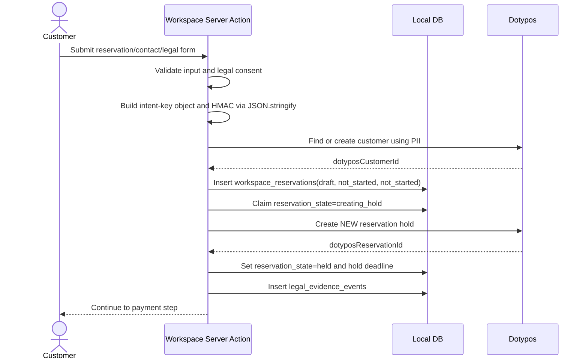
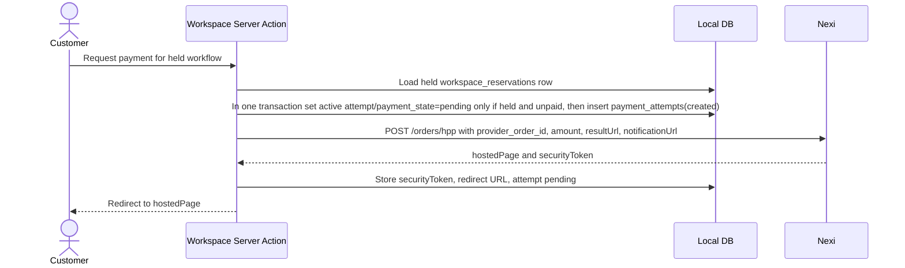
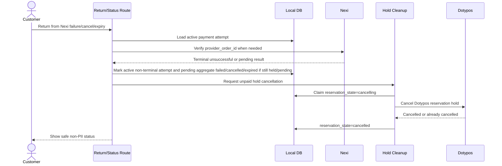
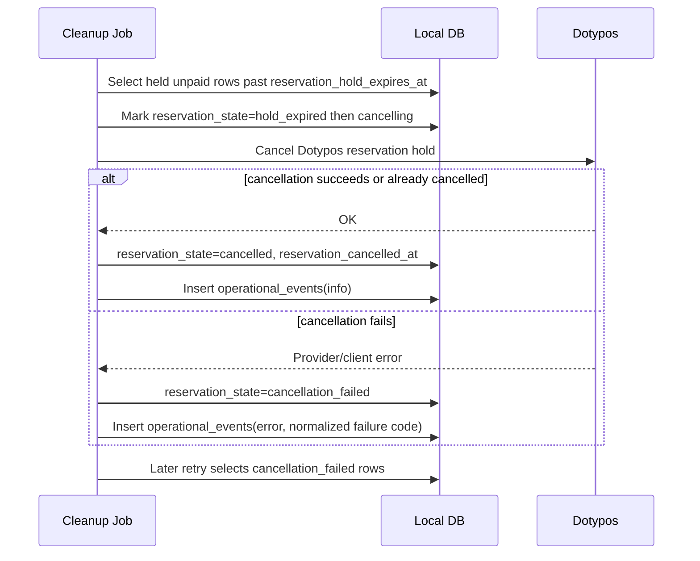
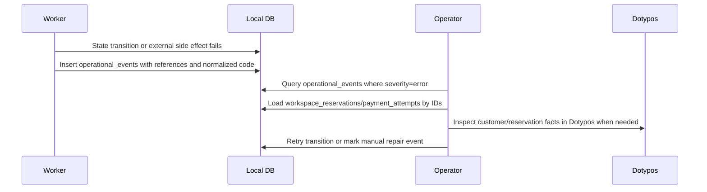

# Workspace Checkout Lifecycle

This document is the Phase 1 contract for the Workspace checkout database rewrite. It supersedes the earlier `payment_orders`-centered model for new implementation work.

The local database is a Deskohub workflow, payment, legal, and recovery ledger. Dotypos remains the source of truth for customer facts and reservation facts. Nexi remains the source of truth for payment processing facts. The local database must not become a customer profile store, a reservation fact store, a raw provider payload archive, or a return-state token store.

## Final Tables

The target schema has exactly these checkout lifecycle tables:

- `workspace_reservations`
- `payment_attempts`
- `webhook_events`
- `legal_evidence_events`
- `operational_events`

Do not recreate `checkout_return_state_tokens` as a state table. Return pages must derive enough context from signed URL state, route parameters, Nexi verification, and the durable rows above.

## Ownership

| Data | Owner | Local DB contract |
| --- | --- | --- |
| Customer name, email, phone | Dotypos customer | Store only `dotypos_customer_id`. Never store as columns, JSON, event text, or raw payload. |
| Dotypos reservation date, service options, staff note, reservation status | Dotypos reservation | Store `dotypos_reservation_id` and local workflow timestamps/states only. Read Dotypos when reservation facts are needed. |
| Reservation intent idempotency | Deskohub workflow | Store only the HMAC intent key. The object payload used to derive it is transient and must not be persisted. |
| Payment session and terminal state | Nexi plus Deskohub workflow | Store payment attempts, Nexi order IDs, non-PII security tokens, operation IDs/statuses, redirect URL if needed for retry support, and local payment state. |
| Nexi webhooks | Nexi plus Deskohub workflow | Store dedupe identity and normalized processing state. Never store raw notification bodies or optional sensitive provider fields. |
| Legal acceptance | Deskohub legal evidence | Store document keys, paths, hashes, acceptance booleans, timestamps, locale, source, and idempotency keys. Never store rendered legal documents or customer contact data. |
| Recovery/audit diagnostics | Deskohub operations | Store normalized event type, severity, non-PII entity references, and human-informative non-PII messages. Never store raw Dotypos/Nexi payloads. |

## No-PII Policy

No customer PII may be persisted in database columns, JSON, text messages, or event metadata. This includes customer name, email, phone number, payment instrument data, Nexi `customerInfo`, raw provider payloads, and free-form user notes.

Allowed local values:

- Dotypos customer IDs and reservation IDs.
- Deskohub IDs, correlation IDs, HMAC intent keys, payment attempt IDs, webhook event IDs, and provider operation IDs.
- Nexi `securityToken`, because it is short-lived non-PII and needed for payment-attempt safety.
- Legal document paths and hashes.
- Local state enums, timestamps, normalized failure codes, and short operational messages generated from application-owned templates.
- Payment amounts, currencies, quote fingerprints, and product price metadata needed to verify a Nexi result, provided they do not include customer or reservation facts that Dotypos owns.

Enforcement boundary:

- Server actions may hold customer PII in memory only long enough to find or create the Dotypos customer and derive the transient intent-key payload.
- Repository inputs must be shaped so PII has no destination field.
- `jsonb` columns must use schemas that exclude customer contact fields, free-form customer notes, raw provider envelopes, and raw Dotypos responses.
- Logs may contain PII only under the application's global filtering policy. Database-backed operational events must be stricter and contain no PII.
- `operational_events.message` is application-derived from an approved `event_type` template. Callers do not pass free-form message text; recovery details must use non-PII IDs, failure codes, and approved event types.
- Any future column or JSON field that can carry customer-authored free text is forbidden unless a separate privacy review explicitly reclassifies it.

## Table Contracts

### `workspace_reservations`

One row per Deskohub checkout workflow for a Dotypos reservation hold and its payment lifecycle.

| Column | Type | Required | Purpose |
| --- | --- | --- | --- |
| `id` | text | yes | Local workflow ID. Stable route/support reference. |
| `reservation_intent_key` | text | yes | HMAC idempotency key for duplicate submits of the same checkout intent and same reservation details. Stores only the digest. |
| `correlation_id` | text | yes | Non-PII cross-system tracing ID. Unique. |
| `dotypos_customer_id` | text | yes | Dotypos customer that owns customer PII. |
| `dotypos_reservation_id` | text | no | Dotypos reservation hold/final reservation ID. Null until Dotypos creates it. |
| `reservation_state` | text enum | yes | Local reservation workflow state. |
| `payment_state` | text enum | yes | Aggregate payment state across attempts. |
| `fulfillment_state` | text enum | yes | Local post-payment/legal-delivery workflow state. |
| `active_payment_attempt_id` | text | no | Current payment attempt, if a Nexi session exists. |
| `reservation_hold_expires_at` | timestamptz | no | Local hold deadline used for cleanup scheduling. Mirrors Deskohub hold policy, not Dotypos facts. |
| `reservation_hold_expired_at` | timestamptz | no | When local cleanup observed the hold as expired. |
| `reservation_created_at` | timestamptz | no | When Dotypos reservation creation succeeded. |
| `reservation_confirmed_at` | timestamptz | no | When paid workflow confirmed the Dotypos reservation. |
| `reservation_cancelled_at` | timestamptz | no | When Dotypos cancellation succeeded or Dotypos already reported cancellation. |
| `paid_at` | timestamptz | no | When a verified Nexi attempt made the workflow paid. |
| `fulfilled_at` | timestamptz | no | When all required post-payment work completed. |
| `fulfillment_failed_at` | timestamptz | no | Most recent fulfillment failure time. |
| `failure_code` | text | no | Normalized non-PII workflow failure code. |
| `fulfillment_failure_code` | text | no | Normalized non-PII fulfillment failure code. |
| `created_at` | timestamptz | yes | DB-managed creation timestamp. |
| `updated_at` | timestamptz | yes | DB-managed update timestamp. |

Indexes and constraints:

- Primary key on `id`.
- Unique index on `reservation_intent_key`.
- Unique index on `correlation_id`.
- Partial unique index on `dotypos_reservation_id` where not null.
- Partial index on `reservation_hold_expires_at` for `reservation_state = 'held'`.
- Recovery index on `(reservation_state, payment_state, fulfillment_state)`.
- `dotypos_reservation_id` must be non-null for `held`, `confirming`, `confirmed`, `cancelling`, `cancelled`, and `cancellation_failed` states.
- `paid_at` must be non-null when `payment_state = 'paid'`.
- `fulfilled_at` must be non-null when `fulfillment_state = 'fulfilled'`.
- `fulfillment_failed_at` and `fulfillment_failure_code` must be non-null when `fulfillment_state = 'failed'`.

### `payment_attempts`

One row per Nexi HPP/session creation attempt. Retries create new attempts instead of overwriting prior attempt history.

| Column | Type | Required | Purpose |
| --- | --- | --- | --- |
| `id` | text | yes | Local payment attempt ID. |
| `workspace_reservation_id` | text | yes | Parent workflow row. |
| `provider` | text enum | yes | Initial value: `nexi`. |
| `provider_order_id` | text | yes | Nexi order ID, normally the value sent to `order.orderId`. Unique for Nexi. |
| `security_token` | text | no | Nexi HPP security token. Short-lived non-PII. |
| `state` | text enum | yes | Attempt-level payment state. |
| `amount_value` | integer | yes | Expected payment amount in scaled integer form. |
| `amount_exponent` | integer | yes | Currency exponent used for amount verification. |
| `currency` | text | yes | Uppercase ISO currency code. |
| `provider_redirect_url` | text | no | Nexi hosted page URL, if needed to resume redirect before expiry. |
| `last_webhook_event_id` | text | no | Last normalized webhook event applied to this attempt. |
| `last_provider_operation_id` | text | no | Last provider operation ID observed. |
| `last_provider_status` | text | no | Last normalized provider status observed. |
| `failure_code` | text | no | Normalized non-PII unsuccessful terminal code. |
| `created_at` | timestamptz | yes | DB-managed creation timestamp. |
| `updated_at` | timestamptz | yes | DB-managed update timestamp. |

Indexes and constraints:

- Primary key on `id`.
- Foreign key to `workspace_reservations(id)`.
- Unique index on `(provider, provider_order_id)`.
- Index on `workspace_reservation_id`.
- Recovery index on `(state, created_at)`.
- `provider = 'nexi'` for the initial implementation.
- `amount_exponent` must be between `0` and `20`.
- `currency` must be uppercase three-letter text.
- `failure_code` must be non-null for failed/cancelled/expired terminal states.

### `webhook_events`

One row per Nexi webhook event identity for dedupe and normalized processing status.

| Column | Type | Required | Purpose |
| --- | --- | --- | --- |
| `id` | text | yes | Local webhook row ID. |
| `provider` | text enum | yes | Initial value: `nexi`. |
| `event_id` | text | yes | Provider event ID or deterministic identity derived from non-secret official fields. Unique. |
| `payment_attempt_id` | text | no | Associated payment attempt when known. |
| `provider_order_id` | text | no | Non-PII provider order ID from `operation.orderId`, for lookup before attempt association. |
| `received_at` | timestamptz | yes | When the webhook was received. |
| `processed_at` | timestamptz | no | When processing completed successfully. |
| `state` | text enum | yes | Webhook processing state. |
| `error_code` | text | no | Normalized non-PII processing error code. |
| `created_at` | timestamptz | yes | DB-managed creation timestamp. |
| `updated_at` | timestamptz | yes | DB-managed update timestamp. |

No raw notification payload, `securityToken`, `customerInfo`, warnings, `additionalData`, card data, or provider response body may be stored.

### `legal_evidence_events`

Append-only legal acceptance/rejection evidence. Legal hashes may also be used during workflow decisions, but this table is the durable legal event stream.

| Column | Type | Required | Purpose |
| --- | --- | --- | --- |
| `id` | text | yes | Local legal evidence event ID. |
| `workspace_reservation_id` | text | no | Associated workflow row when known. |
| `idempotency_key` | text | yes | Submit HMAC or other non-PII dedupe key. |
| `document_key` | text | yes | Stable internal document key. |
| `document_path` | text | yes | Path of accepted document version. |
| `document_hash` | text | yes | SHA-256 hash of accepted/rejected document. |
| `hash_algorithm` | text enum | yes | Initial value: `sha256`. |
| `accepted` | boolean | yes | Whether the customer accepted this document/acknowledgement. |
| `accepted_at` | timestamptz | yes | Server timestamp for the acceptance decision. |
| `locale` | text | yes | Locale of the legal document shown. |
| `source` | text | yes | Normalized source, for example `reservation_submit`, `retry_submit`, or `migration_backfill`. |
| `created_at` | timestamptz | yes | DB-managed creation timestamp. |

Indexes and constraints:

- Primary key on `id`.
- Index on `workspace_reservation_id`.
- Index on `(idempotency_key, document_hash)`.
- `hash_algorithm = 'sha256'`.
- No rendered document bodies or PII-bearing consent payloads.

### `operational_events`

Append-only non-PII operational recovery and audit events.

| Column | Type | Required | Purpose |
| --- | --- | --- | --- |
| `id` | text | yes | Local operational event ID. |
| `workspace_reservation_id` | text | no | Related workflow, if any. |
| `payment_attempt_id` | text | no | Related payment attempt, if any. |
| `event_type` | text | yes | Normalized event type. |
| `severity` | text enum | yes | `info`, `warning`, or `error`. |
| `message` | text | yes | Short human-informative message derived from an application-owned event template. Callers never provide this text. |
| `failure_code` | text | no | Normalized non-PII failure code. |
| `dotypos_reservation_id` | text | no | Related Dotypos reservation ID, if useful for recovery. |
| `dotypos_customer_id` | text | no | Related Dotypos customer ID, if useful for recovery. |
| `webhook_event_id` | text | no | Related webhook event identity. |
| `created_at` | timestamptz | yes | DB-managed creation timestamp. |

This table replaces the narrow `reservation_recovery_events` shape. Repositories must construct events from typed event keys and typed non-PII parameters; the persisted `message` is generated internally from constants/templates for the selected event type. Callers must not pass arbitrary text, user text, raw errors, raw provider text, raw Dotypos text, `String(cause)`, customer names, emails, phones, or customer-authored notes. The no-PII boundary is structural and must not rely on runtime PII-pattern detection or regex scanning.

## Lifecycle Enums

### Reservation State

- `draft`: local workflow exists before Dotypos hold creation is claimed.
- `creating_hold`: a worker has claimed Dotypos reservation hold creation.
- `held`: Dotypos has a `NEW` hold and local payment may proceed.
- `hold_expired`: local policy observed the hold deadline before payment completed.
- `confirming`: payment is verified paid and a worker is confirming/finalizing the Dotypos reservation.
- `confirmed`: Dotypos reservation is confirmed/final for the paid booking.
- `cancelling`: a worker is cancelling a Dotypos hold.
- `cancelled`: Dotypos hold was cancelled or Dotypos already reports it as cancelled.
- `cancellation_failed`: cancellation failed and needs retry/manual recovery.

Allowed reservation transitions:

- `draft -> creating_hold -> held`
- `creating_hold -> cancellation_failed` when the hold is created in Dotypos but local attach/cancel recovery fails.
- `creating_hold -> draft` only when Dotypos hold creation failed before any Dotypos reservation ID existed.
- `held -> confirming -> confirmed` after verified paid payment.
- `held -> hold_expired -> cancelling -> cancelled` for unpaid expired holds.
- `held -> cancelling -> cancelled` for unsuccessful terminal payment before hold expiry.
- `cancelling -> cancellation_failed`
- `cancellation_failed -> cancelling -> cancelled`

Forbidden reservation transitions:

- Any transition from `cancelled` or `confirmed` without an explicit manual repair path.
- Any creation of a second Dotypos reservation for the same `reservation_intent_key`.
- Any cancellation finalization unless the row is still in `cancelling`, unpaid, and unconfirmed.

### Payment State

Aggregate `workspace_reservations.payment_state` values:

- `not_started`: no active Nexi session exists.
- `pending`: at least one Nexi attempt is awaiting a terminal result.
- `paid`: Nexi verification confirmed successful payment.
- `failed`: Nexi verification returned payment failure.
- `cancelled`: Nexi/customer cancelled payment.
- `expired`: Nexi/session/hold expiry ended the payment workflow.

Attempt-level `payment_attempts.state` values:

- `created`: local attempt exists before HPP session details are attached.
- `pending`: customer can be redirected to Nexi or Nexi is processing.
- `paid`: verified terminal successful attempt.
- `failed`: verified terminal failed attempt.
- `cancelled`: verified terminal cancellation.
- `expired`: verified terminal expiry or local attempt expiry.

Allowed payment transitions:

- Reservation aggregate: `not_started -> pending -> paid`.
- Reservation aggregate: `not_started -> pending -> failed|cancelled|expired`.
- Attempt: `created -> pending -> paid|failed|cancelled|expired`.
- Terminal aggregate updates require the active payment attempt ID and only apply while the aggregate state is still `pending` on a held reservation.
- Attempt terminal updates only apply from non-terminal attempt states; `paid` can only be set from `pending`.
- Webhook terminal updates must update the attempt row and reservation aggregate in one database transaction. Provider retries may reapply a matching terminal attempt/reservation pair as an idempotent no-op, but must not mark one side terminal when the other side fails its guard.
- Failed/cancelled/expired workflows may create a new `payment_attempts` row only when the reservation is still `held` and hold deadline is valid.
- `paid` is terminal for payment state.

### Fulfillment State

- `not_started`: no post-payment confirmation/delivery work has completed.
- `processing`: paid workflow is claimed by a fulfillment worker.
- `fulfilled`: Dotypos reservation confirmation and required access/internal notifications are complete.
- `failed`: payment succeeded but fulfillment needs retry or manual recovery.

Allowed fulfillment transitions:

- `not_started -> processing -> fulfilled`
- `not_started -> processing -> failed`
- `failed -> processing -> fulfilled`
- `processing -> failed`

Fulfillment is allowed only when `payment_state = 'paid'`.

## Intent-Key HMAC

The reservation intent key deduplicates repeated submits of the same checkout intent and same reservation details before payment. Store only the HMAC digest in `workspace_reservations.reservation_intent_key` and legal evidence `idempotency_key`.

A fresh form/session must generate a new opaque `reservationIntentId`, so a customer can submit a second reservation with the same date, product, and contact details. The intent key must also include normalized reservation details, so changing date/tier/options within an existing mounted form does not reuse an incompatible Dotypos hold.

Use `JSON.stringify` on a fixed object payload. Do not sort keys. Do not build a delimiter-joined tuple. The object construction order is the contract.

Example transient payload before HMAC:

```json
{
  "schema": "workspace-reservation-intent-key",
  "schemaVersion": 2,
  "reservationIntentId": "opaque-client-intent-id",
  "name": "Ada Lovelace",
  "email": "ada@example.test",
  "phone": "+420777000111",
  "date": "2026-06-10",
  "entryTier": "basic",
  "coffee": false,
  "monitorOption": null
}
```

Example implementation shape:

```ts
const intentKeyPayload = {
  schema: "workspace-reservation-intent-key",
  schemaVersion: 2,
  reservationIntentId,
  name: normalizedName,
  email: normalizedEmail,
  phone: normalizedPhone,
  date: reservation.date,
  entryTier: reservation.entryTier,
  coffee: reservation.coffee,
  monitorOption: reservation.monitorOption ?? null,
};

const reservationIntentKey = createHmac("sha256", secret)
  .update(JSON.stringify(intentKeyPayload))
  .digest("hex");
```

The payload contains customer PII transiently in memory. It must not be persisted. Logs are subject to the application's global filtering policy. The stored HMAC is non-PII for this system's purposes.

## Sequence Diagrams

### Reservation Submit And Hold



### Payment Attempt And Nexi Redirect



### Webhook Success And Dotypos Confirmation

```mermaid
sequenceDiagram
  participant Nexi
  participant Webhook as Webhook Route
  participant DB as Local DB
  participant Dotypos
  participant Fulfillment

  Nexi->>Webhook: Official notification envelope
  Webhook->>Webhook: Decode envelope; derive event identity
  Webhook->>DB: Insert webhook_events(received) or load duplicate state
  alt duplicate processed
    Webhook-->>Nexi: No-op success
  else duplicate failed/received or fresh event
  Webhook->>DB: Claim retry only if webhook_events is not processed
  Webhook->>DB: Load payment attempt by provider_order_id
  Webhook->>Webhook: Compare notification securityToken if present
  Webhook->>Nexi: GET /orders/{provider_order_id}
  Nexi-->>Webhook: Verified payment result
  Webhook->>DB: In one transaction mark active attempt paid and reservation payment_state=paid if still held/pending
  Webhook->>DB: Claim fulfillment_state=processing and reservation_state=confirming
  Fulfillment->>Dotypos: Confirm/finalize reservation using dotyposReservationId
  Dotypos-->>Fulfillment: Confirmation success
  Fulfillment->>DB: reservation_state=confirmed, fulfillment_state=fulfilled
  Webhook->>DB: webhook_events processed
  end
```

### Nexi Failure, Cancel, Or Expired Return



### Expired Hold Cleanup And Cancellation Retry



### Operational Recovery Events



## Recovery Rules

| Scenario | Query shape | Recovery action |
| --- | --- | --- |
| Held reservation without payment | `reservation_state = 'held' and payment_state = 'not_started'` | Allow payment attempt until hold expires. |
| Pending payment | `payment_state = 'pending'` plus active attempt | Wait for webhook, verify with Nexi, or show pending status. |
| Paid but not fulfilled | `payment_state = 'paid' and fulfillment_state in ('not_started', 'failed')` | Run fulfillment worker. |
| Fulfillment stuck | `payment_state = 'paid' and fulfillment_state = 'processing'` | Inspect staleness; retry only through guarded repair path. |
| Expired unpaid hold | `reservation_state = 'held' and payment_state <> 'paid' and reservation_hold_expires_at <= now()` | Cancel Dotypos hold. |
| Cancellation failed | `reservation_state = 'cancellation_failed'` | Retry Dotypos cancellation; write operational event. |
| Duplicate webhook | Existing `webhook_events.event_id` | Return duplicate/accepted response without reapplying side effects. |
| Legal rejection | `legal_evidence_events.accepted = false` | Do not create hold/payment; show legal consent error. |

## Live Test Safety Checklist

- Confirm the database branch is development/preview, not production, before schema reset or test checkout.
- Confirm migrations do not create `checkout_return_state_tokens`.
- Confirm `workspace_reservations`, `payment_attempts`, `webhook_events`, `legal_evidence_events`, and `operational_events` have no PII-capable columns or raw payload columns.
- Confirm intent-key derivation stores only the HMAC and uses `JSON.stringify` on the fixed object payload.
- Confirm Dotypos test customer lookup/create is the only persistence destination for customer name, email, and phone.
- Confirm Dotypos reservation is created as a hold before payment only for the approved hold workflow, and Dotypos remains the source of reservation facts.
- Confirm Nexi `securityToken` is stored only on `payment_attempts` and is not copied to webhook events or operational events.
- Confirm webhook handling verifies through Nexi before marking payment paid or terminal unsuccessful.
- Confirm failure/cancel/expired payment paths cancel unpaid Dotypos holds or create non-PII operational events for retry.
- Confirm all DB-backed operational messages are non-PII and do not include `String(cause)` when causes may contain provider/customer payloads.
- Confirm test data uses clearly fake customers and test payment instruments.
- Confirm no production Dotypos or Nexi credentials are used for live tests unless an explicit production smoke test has been approved.
