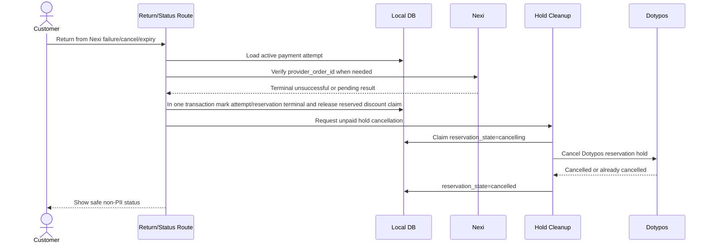
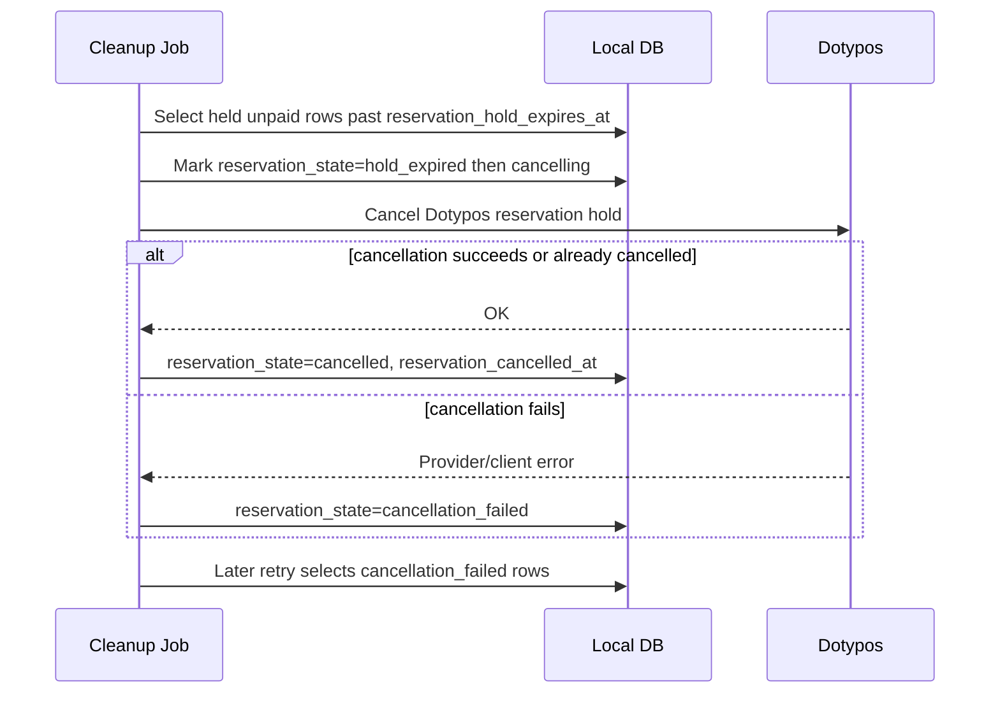

# Workspace Checkout Lifecycle

This document is the Phase 1 contract for the Workspace checkout database rewrite. It supersedes the earlier `payment_orders`-centered model for new implementation work.

The local database is a Deskohub workflow, payment, legal, and recovery ledger. Dotypos remains the source of truth for customer facts and reservation facts. Nexi remains the source of truth for external payment processing facts; an exactly zero payable total completes through an internal paid attempt without contacting Nexi. The local database must not become a customer profile store, a reservation fact store, a raw provider payload archive, or a return-state token store.

## Core lifecycle tables

The core checkout lifecycle uses these tables:

- `workspace_reservations`
- `payment_attempts`
- `webhook_events`
- `legal_evidence_events`

Do not recreate `checkout_return_state_tokens` as a state table. Return pages must derive enough context from signed URL state, route parameters, Nexi verification, and the durable rows above.

Discount configuration and audit history extend this lifecycle through `discounts`, `discount_targets`, `discount_codes`, `discount_code_customers`, `discount_applications`, and `discount_code_redemptions`. These tables store only source-neutral benefit configuration, Dotypos customer IDs, generic application snapshots, and claim state. They must not store customer contact data, Workspace access codes, or raw provider payloads. See [Workspace discount-code operations](./discount-codes.md).

Customer marketing consent is independent of a reservation and lives in `customer_marketing_consents`, keyed directly by the stable Dotypos customer ID. The reservation page always shows a privacy notice and link, but privacy-policy acknowledgement is not a consent gate and is not persisted. The optional marketing checkbox grants customer-level consent; leaving it unchecked is a no-op, not a withdrawal.

## Advertised, quoted, and payable prices

Checkout has three distinct price boundaries:

1. The reservation page advertises a price.
2. Reservation submission creates the authoritative price quote and derives the order summary that the customer reviews.
3. Order submission freshly affirms that signed summary before payment begins.

The server must issue an integrity-protected advertisement snapshot for only the product and reservation inputs that determine the price visible on the reservation page. Cowork monitor selection affects availability and final product composition, but its amount is always zero, so it is excluded from the advertised-price request, quote items, and quote fingerprint. The selected monitor is still validated during reservation submission and recorded in the signed reservation state. Reservation-page advertisement evaluates only automatic discounts that can be discovered without customer identity; currently this means Calendar sales. It must not resolve or create a Dotypos customer merely to advertise a price. Customer-specific pricing is outside the advertisement boundary by contract and does not need an inert marker in the snapshot. The snapshot contains no customer PII and is carried back by the reservation form without treating client-authored price data as authoritative. The signed order-summary state performs the same role for the price reviewed on the summary page.

When a customer returns from Pay to edit a reservation, reservation-page availability projects the inventory that will exist after supersession. The availability request carries the already-signed Pay state separately from the public selection query. The server may exclude exactly one hold only after verifying that the signed order and checkout session still identify the current held reservation, its payment state permits supersession, and Dotypos still reports it as `NEW`. The inventory snapshot must independently confirm that the excluded reservation is still `NEW`; all other reservations and Calendar limitations remain in force. This projection is advisory only. Submission must still cancel the old hold and then perform the normal exclusion-free availability check before creating its replacement.

A reservation quote contains authoritative pricing facts only: itemized priced components, payment totals, applied generic discounts, and the quote fingerprint. It does not contain the checkout summary or duplicate reservation selection. The checkout summary is a deterministic family-owned projection of the signed reservation plus its quote. This keeps zero-priced composition such as the selected cowork monitor visible to the customer without making it a price input or allowing UI structure to affect the price fingerprint.

On reservation submission, the server opens the advertisement snapshot and freshly affirms only the anonymously discoverable automatic discounts that were advertised. A Calendar sale that became available after the snapshot was issued is not added retrospectively. After that boundary is affirmed, the normal reservation workflow resolves or creates the Dotypos customer and evaluates the customer discount for the first signed order summary. Because customer-specific pricing could not be evaluated at the anonymous advertisement boundary, that customer discount may first appear on the summary without producing `pricing_changed`. This is an explicit boundary contract, not a general permission to introduce later automatic discounts.

Once a customer discount has appeared in a signed summary, it is an accepted discount like any other: code submission must affirm it before changing the summary, final order submission must freshly affirm it, and its disappearance or change produces the normal `pricing_changed` result. No later workflow may use the anonymous-advertisement exception to replace, add, or silently remove a customer discount that the customer has already seen.

`pricing_changed` is a normal workflow result at both transitions, not an exceptional checkout failure:

- If anonymous discount discovery fails before the reservation page is rendered, log the error, omit that discount from the advertisement, and continue without it. Quote generation must not add an anonymously discoverable automatic discount that becomes available after the advertisement snapshot was issued.
- If a discount in the advertisement snapshot cannot be included when reservation submission creates the quote, create the current quote without that discount and return `pricing_changed` for every affected summary product key, such as `product:cowork:basic`. The customer must review the changed summary before payment can be requested.
- If a discount in the signed summary cannot be freshly affirmed at order submission, return `pricing_changed` with a refreshed signed summary. Create no durable payment attempt and no external payment session.
- Newly available anonymously discoverable automatic discounts are never introduced retrospectively during quote generation or final affirmation. They may appear only through a new advertisement/summary cycle. The customer discount may first appear only at the first signed-summary boundary after Dotypos identity resolution, as described above. A successfully submitted discount code is a separate deliberate exception because the customer explicitly requested that quote change.

Calendar discovery caching never extends the accepted interval. Eligibility is
checked against the current instant after a cached occurrence is read, so the
exclusive-end Prague midnight remains authoritative without waiting for the
60-second discovery cache to expire.

Discount code entry belongs on the order-summary page as an independent form with its own server action, pending state, and field error. It must not resubmit the reservation form or the main order submission:

- The action receives the current signed summary and submitted code.
- It first affirms every discount already displayed. If any changed, it returns the normal `pricing_changed` result and a refreshed signed summary.
- An unavailable or invalid code returns a field-level error and leaves the existing signed summary payable. It never blocks proceeding without the code.
- A valid code returns a new signed summary containing the code discount. It does not create a payment attempt, persist an application, or reserve code capacity.
- Once present in the signed summary, a code follows the same final affirmation and payment-lifecycle rules as every other discount.

The hard payment invariant is that the accepted payment attempt amount must exactly equal the last signed summary price shown to the customer. Order submission freshly affirms exactly the discounts in that summary and compares the complete quote fingerprint and total. A mismatch—or a failure to persist applications or admit a claim atomically—returns `pricing_changed`; the transaction rolls back and Nexi is not called. A positive total creates a Nexi attempt and HPP session. An exactly zero total atomically creates an already-paid `internal` attempt, marks the reservation paid, persists application snapshots, and immediately redeems any admitted code claim; it never prepares or calls Nexi.

Advertised, signed, and freshly affirmed quotes and local payment attempts always retain the catalog currency. The controlled non-production Nexi sandbox currency override is a provider-adapter exception only: Workspace applies it immediately before HPP creation and again when constructing Nexi verification arguments. The override never changes locally persisted payment facts, the customer-visible quote, its numeric minor-unit value, or its exponent, and it is unavailable for production or the live Nexi origin.

## Ownership

| Data | Owner | Local DB contract |
| --- | --- | --- |
| Customer name, email, phone | Dotypos customer | Store only `dotypos_customer_id`. Never store as columns, JSON, event text, or raw payload. |
| Dotypos reservation date, service options, staff note, reservation status | Dotypos reservation | Store `dotypos_reservation_id` and local workflow timestamps/states only. Read Dotypos when reservation facts are needed. |
| Checkout session and attempt idempotency | Deskohub workflow | Store only the HMAC session and attempt keys. The object payloads used to derive them are transient and must not be persisted. |
| Payment session and terminal state | Nexi plus Deskohub workflow | Store positive Nexi attempts with their external identifiers and store zero-total internal attempts without external fields. |
| Nexi webhooks | Nexi plus Deskohub workflow | Store dedupe identity and normalized processing state. Never store raw notification bodies or optional sensitive provider fields. |
| Administration order and operation views | Nexi, joined to Deskohub attempts | Read current orders and operations from Nexi on demand and expose only allowlisted identifiers, status, channel, timestamps, and amounts. Do not persist provider snapshots. |
| Customer marketing consent | Deskohub customer consent | Store one active-or-withdrawn row per `dotypos_customer_id`, with the accepted marketing document hash, locale, and grant/withdrawal timestamps. Never store customer contact data. |
| Reservation terms acceptance | Deskohub legal evidence | Store the accepted terms and operating-rules document keys, paths, hashes, timestamps, locale, and source. Never store rendered legal documents or customer contact data. |

## No-PII Policy

No customer PII may be persisted in plaintext database columns, JSON, text messages, or event metadata. This includes customer name, email, phone number, payment instrument data, Nexi `customerInfo`, raw provider payloads, and free-form user notes. The sole accounting exception is a versioned invoice-source snapshot encrypted by PostgreSQL `pgcrypto` into `accounting_document_snapshots.encrypted_snapshot`.

Allowed local values:

- Dotypos customer IDs and reservation IDs.
- Deskohub IDs, correlation IDs, HMAC checkout session and attempt keys, payment attempt IDs, webhook event IDs, and provider operation IDs.
- Nexi `securityToken`, because it is short-lived non-PII and needed for payment-attempt safety.
- Legal document paths and hashes.
- Customer marketing grant and withdrawal timestamps.
- Local state enums, timestamps, and normalized failure codes.
- Payment amounts, currencies, quote fingerprints, and product price metadata needed to verify a Nexi result, provided they do not include customer or reservation facts that Dotypos owns.
- An immutable accounting snapshot encrypted into `bytea`, with only its non-PII payment-attempt/reservation references, schema version, key ID, and creation time stored in plaintext.

Enforcement boundary:

- Server actions may hold customer PII in memory only long enough to find or create the Dotypos customer and derive the transient checkout-key payloads.
- Nexi HPP creation may transmit the signed reservation's customer name, email, and normalized phone fields as `order.customerInfo`; provider adapters must not persist or log those values.
- Repository inputs must be shaped so PII has no plaintext destination field. Accounting snapshot plaintext may reach only the parameterized `pgp_sym_encrypt` call.
- `jsonb` columns must use schemas that exclude customer contact fields, free-form customer notes, raw provider envelopes, and raw Dotypos responses.
- Database query logs may retain non-sensitive parameters for diagnostics, but every confidential scalar must use `sensitiveDatabaseParameter` and structured parameters must pass through the shared recursive censor. Accounting encryption and decryption queries must mark the plaintext and key parameters, disable application tracing, and immediately replace raw database failures with stable errors.
- Any future column or JSON field that can carry customer-authored free text is forbidden unless a separate privacy review explicitly reclassifies it.

## Table Contracts

### `workspace_reservations`

One row per Deskohub checkout workflow for a Dotypos reservation hold and its payment lifecycle.

| Column | Type | Required | Purpose |
| --- | --- | --- | --- |
| `id` | text | yes | Local workflow ID. Stable route/support reference. |
| `checkout_session_key` | text | yes | HMAC key grouping deliberate reservation submissions while the customer moves between Reservation and Pay. Stores only the digest. |
| `checkout_attempt_key` | text | yes | HMAC idempotency key for one mounted-form submission and its immediate retry. Includes the normalized reservation details and stores only the digest. |
| `correlation_id` | text | yes | Non-PII cross-system tracing ID. Unique. |
| `dotypos_customer_id` | text | yes | Dotypos customer that owns customer PII. |
| `dotypos_reservation_id` | text | no | Dotypos reservation hold/final reservation ID. Null until Dotypos creates it. |
| `reservation_state` | text enum | yes | Local reservation workflow state. |
| `payment_state` | text enum | yes | Aggregate payment state across attempts. |
| `fulfillment_state` | text enum | yes | Local post-payment/legal-delivery workflow state. |
| `active_payment_attempt_id` | text | no | Current Nexi or internal payment attempt. |
| `reservation_hold_expires_at` | timestamptz | no | Local hold deadline used for cleanup scheduling. Mirrors Deskohub hold policy, not Dotypos facts. |
| `reservation_hold_expired_at` | timestamptz | no | When local cleanup observed the hold as expired. |
| `reservation_created_at` | timestamptz | no | When Dotypos reservation creation succeeded. |
| `reservation_confirmed_at` | timestamptz | no | When paid workflow confirmed the Dotypos reservation. |
| `reservation_cancelled_at` | timestamptz | no | When Dotypos cancellation succeeded or Dotypos already reported cancellation. |
| `paid_at` | timestamptz | no | When a verified Nexi attempt or atomic internal completion made the workflow paid. |
| `fulfilled_at` | timestamptz | no | When all required post-payment work completed. |
| `fulfillment_failed_at` | timestamptz | no | Most recent fulfillment failure time. |
| `failure_code` | text | no | Normalized non-PII workflow failure code. |
| `fulfillment_failure_code` | text | no | Normalized non-PII fulfillment failure code. |
| `created_at` | timestamptz | yes | DB-managed creation timestamp. |
| `updated_at` | timestamptz | yes | DB-managed update timestamp. |

Indexes and constraints:

- Primary key on `id`.
- Unique index on `checkout_attempt_key`.
- Partial unique index on `checkout_session_key` while `reservation_state <> 'cancelled'`.
- Lookup index on `(checkout_session_key, created_at)`.
- Unique index on `correlation_id`.
- Partial unique index on `dotypos_reservation_id` where not null.
- Partial index on `reservation_hold_expires_at` for `reservation_state = 'held'`.
- Recovery index on `(reservation_state, payment_state, fulfillment_state)`.
- `dotypos_reservation_id` must be non-null for `held`, `confirming`, `confirmed`, `cancelling`, `cancelled`, and `cancellation_failed` states.
- `paid_at` must be non-null when `payment_state = 'paid'`.
- `fulfilled_at` must be non-null when `fulfillment_state = 'fulfilled'`.
- `fulfillment_failed_at` and `fulfillment_failure_code` must be non-null when `fulfillment_state = 'failed'`.

### `payment_attempts`

One row per payment attempt. Positive totals create Nexi HPP/session attempts. Exactly zero totals create one already-paid internal attempt in the same transaction that marks the reservation paid. Retries never overwrite attempt history.

| Column | Type | Required | Purpose |
| --- | --- | --- | --- |
| `id` | text | yes | Local payment attempt ID. |
| `workspace_reservation_id` | text | yes | Parent workflow row. |
| `provider` | text enum | yes | `nexi` for positive external payment or `internal` for zero-total completion. |
| `provider_order_id` | text | no | Nexi order ID, normally the value sent to `order.orderId`. Required and unique for Nexi; forbidden for internal attempts. |
| `provider_order_created_at` | timestamptz | no | When Nexi accepted the hosted-payment request and returned its provider session. Set once for new Nexi attempts. |
| `security_token` | text | no | Nexi HPP security token. Short-lived non-PII. |
| `state` | text enum | yes | Attempt-level payment state. |
| `amount_value` | integer | yes | Expected payment amount in scaled integer form. |
| `amount_exponent` | integer | yes | Currency exponent used for amount verification. |
| `currency` | text | yes | Uppercase ISO currency code. |
| `provider_redirect_url` | text | no | Nexi hosted page URL, if needed to resume redirect before expiry. |
| `last_webhook_event_id` | text | no | Last normalized webhook event applied to this attempt. |
| `last_provider_operation_id` | text | no | Last provider operation ID observed. |
| `last_provider_status` | text | no | Last normalized provider status observed. |
| `failure_code` | text | no | Normalized non-PII unsuccessful terminal code. |
| `created_at` | timestamptz | yes | DB-managed creation timestamp. |
| `updated_at` | timestamptz | yes | DB-managed update timestamp. |

Indexes and constraints:

- Primary key on `id`.
- Foreign key to `workspace_reservations(id)`.
- Partial unique index on `provider_order_id` for Nexi attempts.
- Index on `workspace_reservation_id`.
- Recovery index on `(state, created_at)`.
- Nexi attempts have a positive amount and a non-null provider order ID.
- Internal attempts have an exactly zero amount, are inserted already paid, and have no provider order ID, security token, redirect URL, webhook ID, provider operation ID, provider status, or failure code.
- `amount_exponent` must be between `0` and `20`.
- `currency` must be uppercase three-letter text.
- `failure_code` must be non-null for failed/cancelled/expired terminal states.

### `webhook_events`

One row per Nexi webhook event identity for dedupe and normalized processing status.

| Column | Type | Required | Purpose |
| --- | --- | --- | --- |
| `id` | text | yes | Local webhook row ID. |
| `provider` | text enum | yes | Initial value: `nexi`. |
| `event_id` | text | yes | Provider event ID or deterministic identity derived from non-secret official fields. Unique. |
| `payment_attempt_id` | text | no | Associated payment attempt when known. |
| `provider_order_id` | text | no | Non-PII provider order ID from `operation.orderId`, for lookup before attempt association. |
| `received_at` | timestamptz | yes | When the webhook was received. |
| `processed_at` | timestamptz | no | When processing completed successfully. |
| `state` | text enum | yes | Webhook processing state. |
| `error_code` | text | no | Normalized non-PII processing error code. |
| `created_at` | timestamptz | yes | DB-managed creation timestamp. |
| `updated_at` | timestamptz | yes | DB-managed update timestamp. |

No raw notification payload, `securityToken`, `customerInfo`, warnings, `additionalData`, card data, or provider response body may be stored.

### `customer_marketing_consents`

One row per Dotypos customer with a marketing-consent history state. There is no local customer foreign key because Dotypos owns customer identity.

| Column | Type | Required | Purpose |
| --- | --- | --- | --- |
| `dotypos_customer_id` | text | yes | Primary key identifying the consenting Dotypos customer. |
| `document_hash` | text | yes | Hash of the marketing communication document that was accepted. |
| `locale` | text | yes | Locale of the accepted document. |
| `granted_at` | timestamptz | yes | Server timestamp for the current grant. |
| `withdrawn_at` | timestamptz | no | Withdrawal timestamp. Null means the consent is active. |

Granting consent inserts a missing row, leaves an already-active row unchanged, and reactivates a withdrawn row with the newly submitted evidence. An unchecked reservation form never withdraws consent. No historical backfill is required.

### `legal_evidence_events`

Append-only reservation terms acceptance evidence written when the customer submits payment. Customer marketing consent does not belong in this table.

| Column | Type | Required | Purpose |
| --- | --- | --- | --- |
| `id` | text | yes | Local legal evidence event ID. |
| `workspace_reservation_id` | text | no | Associated workflow row when known. |
| `document_key` | text | yes | Stable internal document key. |
| `document_path` | text | yes | Path of accepted document version. |
| `document_hash` | text | yes | SHA-256 hash of accepted/rejected document. |
| `hash_algorithm` | text enum | yes | Initial value: `sha256`. |
| `accepted` | boolean | yes | Whether the customer accepted this document. Current payment writes are accepted terms and operating rules. |
| `accepted_at` | timestamptz | yes | Server timestamp for the acceptance decision. |
| `locale` | text | yes | Locale of the legal document shown. |
| `source` | text | yes | Normalized source. Current checkout writes use `payment_submit`. |
| `created_at` | timestamptz | yes | DB-managed creation timestamp. |

Indexes and constraints:

- Primary key on `id`.
- Index on `workspace_reservation_id`.
- `hash_algorithm = 'sha256'`.
- No rendered document bodies or PII-bearing consent payloads.

## Lifecycle Enums

### Reservation State

- `draft`: local workflow exists before Dotypos hold creation is claimed.
- `creating_hold`: a worker has claimed Dotypos reservation hold creation.
- `held`: Dotypos has a `NEW` hold and local payment may proceed.
- `hold_expired`: local policy observed the hold deadline before payment completed.
- `confirming`: payment is verified paid and a worker is confirming/finalizing the Dotypos reservation.
- `confirmed`: Dotypos reservation is confirmed/final for the paid booking.
- `cancelling`: a worker is cancelling a Dotypos hold.
- `cancelled`: Dotypos hold was cancelled or Dotypos already reports it as cancelled.
- `cancellation_failed`: cancellation failed and needs retry/manual recovery.

Allowed reservation transitions:

- `draft -> creating_hold -> held`
- `creating_hold -> cancellation_failed` when the hold is created in Dotypos but local attach/cancel recovery fails.
- `creating_hold -> draft` only when Dotypos hold creation failed before any Dotypos reservation ID existed.
- `held -> confirming -> confirmed` after verified paid payment.
- `held -> hold_expired -> cancelling -> cancelled` for unpaid expired holds.
- `held -> cancelling -> cancelled` for unsuccessful terminal payment before hold expiry.
- `cancelling -> cancellation_failed`
- `cancellation_failed -> cancelling -> cancelled`

Forbidden reservation transitions:

- Any transition from `cancelled` or `confirmed` without an explicit manual repair path.
- Any creation of a second Dotypos reservation for the same `checkout_attempt_key`.
- Any creation of a replacement Dotypos reservation in the same checkout session before the prior local and Dotypos reservations are cancelled.
- Any cancellation finalization unless the row is still in `cancelling`, unpaid, and unconfirmed.

### Payment State

Aggregate `workspace_reservations.payment_state` values:

- `not_started`: no active payment attempt exists.
- `pending`: a Nexi attempt is awaiting a terminal result.
- `paid`: Nexi verification or an atomic zero-total internal completion confirmed successful payment.
- `failed`: Nexi verification returned payment failure.
- `cancelled`: Nexi/customer cancelled payment.
- `expired`: Nexi/session/hold expiry ended the payment workflow.

Attempt-level `payment_attempts.state` values:

- `created`: local attempt exists before HPP session details are attached.
- `pending`: customer can be redirected to Nexi or Nexi is processing.
- `paid`: verified terminal successful attempt.
- `failed`: verified terminal failed attempt.
- `cancelled`: verified terminal cancellation.
- `expired`: verified terminal expiry or local attempt expiry.

Allowed payment transitions:

- Reservation aggregate: `not_started -> pending -> paid`.
- Reservation aggregate: `not_started -> pending -> failed|cancelled|expired`.
- Zero-total reservation aggregate: `not_started|failed|cancelled|expired -> paid` atomically with insertion of an already-paid internal attempt.
- Attempt: `created -> pending -> paid|failed|cancelled|expired`.
- Internal attempt: inserted directly as `paid`; no later provider or terminal transition applies.
- Terminal aggregate updates require the active payment attempt ID and only apply while the aggregate state is still `pending` on a held reservation.
- Attempt terminal updates only apply from non-terminal attempt states; `paid` can only be set from `pending`.
- Webhook terminal updates must update the attempt row and reservation aggregate in one database transaction. Provider retries may reapply a matching terminal attempt/reservation pair as an idempotent no-op, but must not mark one side terminal when the other side fails its guard.
- Discount application persistence and code-claim admission belong to the payment-attempt creation transaction. Claim redemption belongs to the paid transaction, and claim release belongs to every failed, cancelled, or expired transaction. Any application, claim, redemption, or release error is fatal and rolls back the owning payment transition; it must never be converted to an empty discount result or `not_pending` state.
- Failed/cancelled/expired workflows may create a new `payment_attempts` row only when the reservation is still `held` and hold deadline is valid.
- `paid` is terminal for payment state.

### Fulfillment State

- `not_started`: no post-payment confirmation/delivery work has completed.
- `processing`: paid workflow is claimed by a fulfillment worker.
- `fulfilled`: Dotypos reservation confirmation and required access/internal notifications are complete.
- `failed`: payment succeeded but fulfillment needs retry or manual recovery.

Allowed fulfillment transitions:

- `not_started -> processing -> fulfilled`
- `not_started -> processing -> failed`
- `failed -> processing -> fulfilled`
- `processing -> failed`

Fulfillment is allowed only when `payment_state = 'paid'`.

Production reaches `fulfilled` only after the Resend delivery webhook confirms
the customer access email. Preview and Development reach `fulfilled` after the
configured email provider accepts the required customer send; the internal
notification remains best effort. Protected Preview deployments cannot receive
provider callbacks reliably. Recovery sends use deterministic
reservation-and-category idempotency keys, and an abandoned `processing` claim
becomes retryable after one minute.

## Checkout Session And Attempt HMACs

`checkoutSessionId` groups the reservation rows created while a customer moves back and forth between Reservation and Pay. It remains stable when the customer returns to the form and deliberately submits again. `checkoutAttemptId` identifies one mounted-form submission and its immediate transport retry; a changed reservation value or a new form mount creates a new attempt. Marketing consent is customer-scoped and is deliberately excluded from the reservation attempt HMAC.

Only HMAC digests are stored in `workspace_reservations.checkout_session_key` and `workspace_reservations.checkout_attempt_key`. The opaque browser IDs are carried only in signed checkout state and action input. Both key payloads use `JSON.stringify` on a fixed object shape; do not sort keys or build a delimiter-joined tuple.

```ts
const checkoutSessionKey = hmac({
  checkoutSessionId,
});

const checkoutAttemptKey = hmac({
  checkoutSessionId,
  checkoutAttemptId,
  reservation: normalizedReservation,
});
```

The normalized reservation is included so a replayed opaque attempt ID with changed values cannot reuse a hold created for different facts; its PII exists only in the transient HMAC payload. An exact attempt-key match makes an immediate retry idempotent. A new attempt in the same session does not mutate or reuse the existing Dotypos reservation: the server claims the previous unpaid hold for cancellation, verifies its live Dotypos status, cancels it when `NEW`, marks its local row cancelled, and creates a fresh local and Dotypos reservation. If the previous row has pending/paid payment, is no longer pending in Dotypos, or its Dotypos cancellation fails, the server leaves that row to its normal lifecycle and rotates to a fresh checkout session before creating the new reservation. Every created row keeps its original cleanup deadline and scheduled cleanup job.

## Sequence Diagrams

### Reservation Submit And Hold

```mermaid
sequenceDiagram
  actor Customer
  participant App as Workspace Server Action
  participant DB as Local DB
  participant Dotypos

  Customer->>App: Submit reservation/contact form with optional marketing consent
  App->>App: Open anonymous advertised-price snapshot
  App->>App: Validate reservation input
  App->>App: Affirm only its advertised anonymous automatic discounts
  App->>App: Derive checkout session and attempt HMACs
  App->>Dotypos: Find or create customer using PII
  Dotypos-->>App: dotyposCustomerId
  opt marketing checkbox checked
    App->>DB: Grant customer_marketing_consents
  end
  App->>App: Evaluate customer discount for the first signed summary
  alt same attempt is already held
    App->>DB: Reuse exact attempt row
  else session has an earlier unpaid hold
    App->>DB: Claim earlier row for cancellation
    App->>Dotypos: Cancel earlier NEW reservation
    App->>DB: Mark earlier row cancelled and insert replacement draft
  else no current row in session
    App->>DB: Insert workspace_reservations(draft, not_started, not_started)
  end
  App->>DB: Claim reservation_state=creating_hold
  App->>Dotypos: Create NEW reservation hold
  Dotypos-->>App: dotyposReservationId
  App->>DB: Set reservation_state=held and hold deadline
  alt advertised price still matches
    App-->>Customer: Show signed order summary, which may first add the customer discount
  else advertised discount unavailable
    App-->>Customer: Show refreshed signed summary with pricing_changed affected product keys; customer discount may still first appear
  end
```

### Independent Discount Code Form

```mermaid
sequenceDiagram
  actor Customer
  participant Summary as Order Summary
  participant App as Workspace Server Action

  Customer->>Summary: Submit discount-code form
  Summary->>App: Current signed summary + submitted code
  App->>App: Affirm every displayed discount
  alt displayed price changed
    App-->>Summary: pricing_changed + refreshed signed summary
  else code unavailable
    App-->>Summary: Field error; retain current signed summary
  else code accepted
    App-->>Summary: New signed summary containing code discount
  end
```

### Payment Attempt And Completion

```mermaid
sequenceDiagram
  actor Customer
  participant App as Workspace Server Action
  participant DB as Local DB
  participant Nexi

  Customer->>App: Request payment for held workflow
  App->>DB: Load held workspace_reservations row
  App->>App: Freshly affirm exactly the signed-summary discounts and total
  alt fingerprint, total, or claim admission changed
    App-->>Customer: pricing_changed + refreshed signed summary; no payment session
  else positive signed price affirmed
    App->>DB: In one transaction create/link attempt, persist discount applications, and reserve code claim
    App->>Nexi: POST /orders/hpp with the exact signed-summary amount
    Nexi-->>App: hostedPage and securityToken
    App->>DB: Store securityToken, redirect URL, attempt pending
    App-->>Customer: Redirect to hostedPage
  else exactly zero signed price affirmed
    App->>DB: In one transaction insert paid internal attempt, mark reservation paid, persist applications, and admit/redeem code claim
    App->>App: Invoke idempotent paid fulfillment
    App-->>Customer: Redirect to local successful checkout status
  end
```

A definitive Nexi HPP rejection atomically marks the attempt failed and releases
its reserved code claim. A network, retryable provider, conflict, rate-limit, or
otherwise ambiguous creation/attachment failure retains the created attempt and
reserved claim. That active attempt blocks a second charge while webhook,
return/status reconciliation, and hold cleanup determine the terminal outcome.

### Webhook Success And Dotypos Confirmation

```mermaid
sequenceDiagram
  participant Nexi
  participant Webhook as Webhook Route
  participant DB as Local DB
  participant Dotypos
  participant Fulfillment

  Nexi->>Webhook: Official notification envelope
  Webhook->>Webhook: Decode envelope; derive event identity
  Webhook->>DB: Insert webhook_events(received) or load duplicate state
  alt duplicate processed
    Webhook-->>Nexi: No-op success
  else duplicate failed/received or fresh event
  Webhook->>DB: Claim retry only if webhook_events is not processed
  Webhook->>DB: Load payment attempt by provider_order_id
  Webhook->>Webhook: Compare notification securityToken if present
  Webhook->>Nexi: GET /orders/{provider_order_id}
  Nexi-->>Webhook: Verified payment result
  Webhook->>DB: In one transaction mark attempt/reservation paid and redeem reserved discount claim
  Webhook->>DB: Claim fulfillment_state=processing and reservation_state=confirming
  Fulfillment->>Dotypos: Confirm/finalize reservation using dotyposReservationId
  Dotypos-->>Fulfillment: Confirmation success
  Fulfillment->>DB: reservation_state=confirmed, fulfillment_state=fulfilled
  Webhook->>DB: webhook_events processed
  end
```

### Nexi Failure, Cancel, Or Expired Return


```mermaid
sequenceDiagram
  actor Customer
  participant Return as Return/Status Route
  participant DB as Local DB
  participant Nexi
  participant Cleanup as Hold Cleanup
  participant Dotypos

  Customer->>Return: Return from Nexi failure/cancel/expiry
  Return->>DB: Load active payment attempt
  Return->>Nexi: Verify provider_order_id when needed
  Nexi-->>Return: Terminal unsuccessful or pending result
  Return->>DB: In one transaction mark attempt/reservation terminal and release reserved discount claim
  Return->>Cleanup: Request unpaid hold cancellation
  Cleanup->>DB: Claim reservation_state=cancelling
  Cleanup->>Dotypos: Cancel Dotypos reservation hold
  Dotypos-->>Cleanup: Cancelled or already cancelled
  Cleanup->>DB: reservation_state=cancelled
  Return-->>Customer: Show safe non-PII status
```

### Expired Hold Cleanup And Cancellation Retry


```mermaid
sequenceDiagram
  participant Job as Cleanup Job
  participant DB as Local DB
  participant Dotypos

  Job->>DB: Select held unpaid rows past reservation_hold_expires_at
  Job->>DB: Mark reservation_state=hold_expired then cancelling
  Job->>Dotypos: Cancel Dotypos reservation hold
  alt cancellation succeeds or already cancelled
    Dotypos-->>Job: OK
    Job->>DB: reservation_state=cancelled, reservation_cancelled_at
  else cancellation fails
    Dotypos-->>Job: Provider/client error
    Job->>DB: reservation_state=cancellation_failed
  end
  Job->>DB: Later retry selects cancellation_failed rows
```

## Recovery Rules

| Scenario | Query shape | Recovery action |
| --- | --- | --- |
| Held reservation without payment | `reservation_state = 'held' and payment_state = 'not_started'` | Allow payment attempt until hold expires. |
| Pending payment | `payment_state = 'pending'` plus active attempt | Wait for webhook, verify with Nexi, or show pending status. |
| Paid but not fulfilled | `payment_state = 'paid' and fulfillment_state in ('not_started', 'failed')` | Run fulfillment worker. |
| Fulfillment stuck | `payment_state = 'paid' and fulfillment_state = 'processing'` | Inspect staleness; retry only through guarded repair path. |
| Expired unpaid hold | `reservation_state = 'held' and payment_state <> 'paid' and reservation_hold_expires_at <= now()` | Cancel Dotypos hold. |
| Cancellation failed | `reservation_state = 'cancellation_failed'` | Retry Dotypos cancellation. |
| Duplicate webhook | Existing `webhook_events.event_id` | Return duplicate/accepted response without reapplying side effects. |

## Live Test Safety Checklist

- Confirm the database branch is development/preview, not production, before schema reset or test checkout.
- Confirm migrations do not create `checkout_return_state_tokens`.
- Confirm `workspace_reservations`, `payment_attempts`, `webhook_events`, `legal_evidence_events`, and `customer_marketing_consents` have no PII-capable columns or raw payload columns.
- Confirm checkout session/attempt key derivation stores only HMAC digests and uses `JSON.stringify` on fixed object payloads.
- Confirm Dotypos test customer lookup/create is the only persistence destination for customer name, email, and phone.
- Confirm Dotypos reservation is created as a hold before payment only for the approved hold workflow, and Dotypos remains the source of reservation facts.
- Confirm Nexi `securityToken` is stored only on `payment_attempts` and is not copied to webhook events.
- Confirm internal attempts are exactly zero, already paid, and contain no Nexi identifiers, security token, redirect URL, webhook, operation, or provider-status fields.
- Confirm webhook handling verifies through Nexi before marking payment paid or terminal unsuccessful.
- Confirm failure/cancel/expired payment paths cancel unpaid Dotypos holds or leave guarded local state for retry.
- Confirm test data uses clearly fake customers and test payment instruments.
- Confirm no production Dotypos or Nexi credentials are used for live tests unless an explicit production smoke test has been approved.
