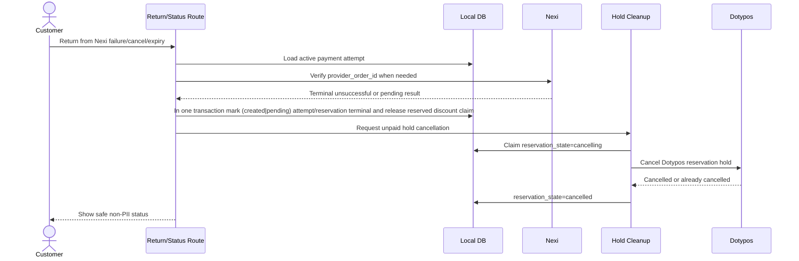

# Workspace Checkout Lifecycle

This document is the Phase 1 contract for the Workspace checkout database rewrite. It supersedes the earlier `payment_orders`-centered model for new implementation work.

The local database is a Deskohub workflow, payment, legal, and recovery ledger. Dotypos remains the source of truth for customer facts and reservation facts. Nexi remains the source of truth for payment processing facts. The local database must not become a customer profile store, a reservation fact store, a raw provider payload archive, or a return-state token store.

## Core lifecycle tables

The core checkout lifecycle uses these tables:

- `workspace_reservations`
- `payment_attempts`
- `payment_paid_events`
- `webhook_events`
- `legal_evidence_events`

Do not recreate `checkout_return_state_tokens` as a state table. Return pages must derive enough context from signed URL state, route parameters, Nexi verification, and the durable rows above.

Discount configuration and audit history extend this lifecycle through `discounts`, `discount_product_targets`, `discount_codes`, `discount_code_customers`, `discount_applications`, and `discount_code_redemptions`. These tables store only source-neutral benefit configuration, Dotypos customer IDs, generic application snapshots, and claim state. They must not store customer contact data, Workspace access codes, or raw provider payloads. See [Workspace discount-code operations](./discount-codes.md).

## Advertised, quoted, and payable prices

Checkout has three distinct price boundaries:

1. The reservation page advertises a price.
2. Reservation submission creates the order-summary quote that the customer reviews.
3. Order submission freshly affirms that signed summary before payment begins.

The server must issue an integrity-protected advertisement snapshot for the product and reservation inputs whose price is visible on the reservation page. Reservation-page advertisement evaluates only automatic discounts that can be discovered without customer identity; currently this means Calendar sales. It must not resolve or create a Dotypos customer merely to advertise a price. Customer-specific pricing is outside the advertisement boundary by contract and does not need an inert marker in the snapshot. The snapshot contains no customer PII and is carried back by the reservation form without treating client-authored price data as authoritative. The signed order-summary state performs the same role for the price reviewed on the summary page.

On reservation submission, the server opens the advertisement snapshot and freshly affirms only the anonymously discoverable automatic discounts that were advertised. A Calendar sale that became available after the snapshot was issued is not added retrospectively. After that boundary is affirmed, the normal reservation workflow resolves or creates the Dotypos customer and evaluates the customer discount for the first signed order summary. Because customer-specific pricing could not be evaluated at the anonymous advertisement boundary, that customer discount may first appear on the summary without producing `pricing_changed`. This is an explicit boundary contract, not a general permission to introduce later automatic discounts.

Once a customer discount has appeared in a signed summary, it is an accepted discount like any other: code submission must affirm it before changing the summary, final order submission must freshly affirm it, and its disappearance or change produces the normal `pricing_changed` result. No later workflow may use the anonymous-advertisement exception to replace, add, or silently remove a customer discount that the customer has already seen.

`pricing_changed` is a normal workflow result at both transitions, not an exceptional checkout failure:

- If anonymous discount discovery fails before the reservation page is rendered, log the error, omit that discount from the advertisement, and continue without it. Quote generation must not add an anonymously discoverable automatic discount that becomes available after the advertisement snapshot was issued.
- If a discount in the advertisement snapshot cannot be included when reservation submission creates the quote, create the current quote without that discount and return `pricing_changed` for every affected summary product key, such as `product:cowork:basic`. The customer must review the changed summary before payment can be requested.
- If a discount in the signed summary cannot be freshly affirmed at order submission, return `pricing_changed` with a refreshed signed summary. Create no durable payment attempt and no external payment session.
- Newly available anonymously discoverable automatic discounts are never introduced retrospectively during quote generation or final affirmation. They may appear only through a new advertisement/summary cycle. The customer discount may first appear only at the first signed-summary boundary after Dotypos identity resolution, as described above. A successfully submitted discount code is a separate deliberate exception because the customer explicitly requested that quote change.

Discount code entry belongs on the order-summary page as an independent form with its own server action, pending state, and field error. It must not resubmit the reservation form or the main order submission:

- The action receives the current signed summary and submitted code.
- It first affirms every discount already displayed. If any changed, it returns the normal `pricing_changed` result and a refreshed signed summary.
- An unavailable or invalid code returns a field-level error and leaves the existing signed summary payable. It never blocks proceeding without the code.
- A valid code returns a new signed summary containing the code discount. It does not create a payment attempt, persist an application, or reserve code capacity.
- Once present in the signed summary, a code follows the same final affirmation and payment-lifecycle rules as every other discount.

The hard payment invariant is that a provider session amount must exactly equal the last signed summary price shown to the customer. Order submission freshly affirms exactly the discounts in that summary and compares the complete quote fingerprint and total. A mismatch—or a failure to persist applications or admit a claim atomically—returns `pricing_changed`; the transaction rolls back and Nexi is not called.

Advertised, signed, and freshly affirmed quotes and local payment attempts always retain the catalog currency. The controlled non-production Nexi sandbox currency override is a provider-adapter exception only: Workspace applies it immediately before HPP creation and again when constructing Nexi verification arguments. The override never changes locally persisted payment facts, the customer-visible quote, its numeric minor-unit value, or its exponent, and it is unavailable for production or the live Nexi origin.

## Ownership

| Data | Owner | Local DB contract |
| --- | --- | --- |
| Customer name, email, phone | Dotypos customer | Store only `dotypos_customer_id`. Never store as columns, JSON, event text, or raw payload. |
| Dotypos reservation date, service options, staff note, reservation status | Dotypos reservation | Store `dotypos_reservation_id` and local workflow timestamps/states only. Read Dotypos when reservation facts are needed. |
| Checkout session and attempt idempotency | Deskohub workflow | Store only the HMAC session and attempt keys. The object payloads used to derive them are transient and must not be persisted. |
| Payment session and terminal state | Nexi plus Deskohub workflow | Store payment attempts, Nexi order IDs, non-PII security tokens, operation IDs/statuses, redirect URL if needed for retry support, and local payment state. |
| Nexi webhooks | Nexi plus Deskohub workflow | Store dedupe identity and normalized processing state. Never store raw notification bodies or optional sensitive provider fields. |
| Legal acceptance | Deskohub legal evidence | Store document keys, paths, hashes, acceptance booleans, timestamps, locale, source, and idempotency keys. Never store rendered legal documents or customer contact data. |

## No-PII Policy

No customer PII may be persisted in database columns, JSON, text messages, or event metadata. This includes customer name, email, phone number, payment instrument data, Nexi `customerInfo`, raw provider payloads, and free-form user notes.

Allowed local values:

- Dotypos customer IDs and reservation IDs.
- Deskohub IDs, correlation IDs, HMAC checkout session and attempt keys, payment attempt IDs, webhook event IDs, and provider operation IDs.
- Nexi `securityToken`, because it is short-lived non-PII and needed for payment-attempt safety.
- Legal document paths and hashes.
- Local state enums, timestamps, and normalized failure codes.
- Payment amounts, currencies, quote fingerprints, and product price metadata needed to verify a Nexi result, provided they do not include customer or reservation facts that Dotypos owns.

Enforcement boundary:

- Server actions may hold customer PII in memory only long enough to find or create the Dotypos customer and derive the transient checkout-key payloads.
- Repository inputs must be shaped so PII has no destination field.
- `jsonb` columns must use schemas that exclude customer contact fields, free-form customer notes, raw provider envelopes, and raw Dotypos responses.
- Logs may contain PII only under the application's global filtering policy.
- Any future column or JSON field that can carry customer-authored free text is forbidden unless a separate privacy review explicitly reclassifies it.

## Table Contracts

### `workspace_reservations`

One row per Deskohub checkout workflow for a Dotypos reservation hold and its payment lifecycle.

| Column | Type | Required | Purpose |
| --- | --- | --- | --- |
| `id` | text | yes | Local workflow ID. Stable route/support reference. |
| `checkout_session_key` | text | yes | HMAC key grouping deliberate reservation submissions while the customer moves between Reservation and Pay. Stores only the digest. |
| `checkout_attempt_key` | text | yes | HMAC idempotency key for one mounted-form submission and its immediate retry. Includes the normalized reservation details and stores only the digest. |
| `correlation_id` | text | yes | Non-PII cross-system tracing ID. Unique. |
| `dotypos_customer_id` | text | yes | Dotypos customer that owns customer PII. |
| `dotypos_reservation_id` | text | no | Dotypos reservation hold/final reservation ID. Null until Dotypos creates it. |
| `reservation_state` | text enum | yes | Local reservation workflow state. |
| `payment_state` | text enum | yes | Aggregate payment state across attempts. |
| `fulfillment_state` | text enum | yes | Local post-payment/legal-delivery workflow state. |
| `active_payment_attempt_id` | text | no | Current payment attempt, if a Nexi session exists. |
| `active_payment_evidence_conflicted` | boolean | yes | Monotonic reservation-wide manual-review fence materialized from conflicts on any attempt belonging to the reservation, including late evidence for a replaced attempt. |
| `payment_reconciliation_attempt_id` | text | no | Exact attempt whose authoritative provider lookup currently owns the reservation. |
| `payment_reconciliation_claim_id` | text | no | Opaque durable ownership claim. Admission, replacement, cleanup, and settlement by another writer fail closed until the owner settles or releases it. |
| `payment_reconciliation_claim_expires_at` | timestamptz | no | Database-clock recovery deadline. After a crashed owner exceeds it, only another read-only reconciliation may take over the exact attempt; new admission remains fail-closed, while unresolved-v2 and conflict guards continue to fence cleanup. |
| `reservation_hold_expires_at` | timestamptz | no | Local hold deadline used for cleanup scheduling. Mirrors Deskohub hold policy, not Dotypos facts. |
| `reservation_hold_expired_at` | timestamptz | no | When local cleanup observed the hold as expired. |
| `reservation_created_at` | timestamptz | no | When Dotypos reservation creation succeeded. |
| `reservation_confirmed_at` | timestamptz | no | When paid workflow confirmed the Dotypos reservation. |
| `reservation_cancelled_at` | timestamptz | no | When Dotypos cancellation succeeded or Dotypos already reported cancellation. |
| `paid_at` | timestamptz | no | When a verified Nexi attempt made the workflow paid. |
| `fulfilled_at` | timestamptz | no | When all required post-payment work completed. |
| `fulfillment_failed_at` | timestamptz | no | Most recent fulfillment failure time. |
| `failure_code` | text | no | Normalized non-PII workflow failure code. |
| `fulfillment_failure_code` | text | no | Normalized non-PII fulfillment failure code. |
| `created_at` | timestamptz | yes | DB-managed creation timestamp. |
| `updated_at` | timestamptz | yes | DB-managed update timestamp. |

Indexes and constraints:

- Primary key on `id`.
- Unique index on `checkout_attempt_key`.
- Partial unique index on `checkout_session_key` while `reservation_state <> 'cancelled'`.
- Lookup index on `(checkout_session_key, created_at)`.
- Unique index on `correlation_id`.
- Partial unique index on `dotypos_reservation_id` where not null.
- Partial index on `reservation_hold_expires_at` for `reservation_state = 'held'`.
- Recovery index on `(reservation_state, payment_state, fulfillment_state)`.
- `dotypos_reservation_id` must be non-null for `held`, `confirming`, `confirmed`, `cancelling`, `cancelled`, and `cancellation_failed` states.
- `paid_at` must be non-null when `payment_state = 'paid'`.
- `fulfilled_at` must be non-null when `fulfillment_state = 'fulfilled'`.
- `fulfillment_failed_at` and `fulfillment_failure_code` must be non-null when `fulfillment_state = 'failed'`.

### `payment_attempts`

One row per Nexi HPP/session creation attempt. A version 2 attempt performs the
state-creating provider POST at most once; an ambiguous result remains on that
same durable attempt for stable-order reconciliation.

| Column | Type | Required | Purpose |
| --- | --- | --- | --- |
| `id` | text | yes | Local payment attempt ID. |
| `workspace_reservation_id` | text | yes | Parent workflow row. |
| `provider` | text enum | yes | Initial value: `nexi`. |
| `provider_order_id` | text | yes | Nexi order ID, normally the value sent to `order.orderId`. Unique for Nexi. |
| `admission_version` | integer | yes | Admission contract version. Existing attempts use `1`; atomic admission writes `2`. |
| `pricing_fingerprint` | text | version 2 | Exact signed-summary fingerprint admitted for this attempt. |
| `displayed_discount_ids` | jsonb array | version 2 | Ordered public discount IDs displayed in the admitted summary. |
| `provider_start_lease_id` | text | created version 2 attempts | Opaque short lease fencing one HPP start/attach owner. |
| `provider_start_lease_expires_at` | timestamptz | created version 2 attempts | Database-clock lease deadline. |
| `provider_evidence_conflicted` | boolean | yes | Monotonic database-materialized settlement fence. |
| `security_token` | text | no | Nexi HPP security token. Short-lived non-PII. |
| `state` | text enum | yes | Attempt-level payment state. |
| `amount_value` | integer | yes | Expected payment amount in scaled integer form. |
| `amount_exponent` | integer | yes | Currency exponent used for amount verification. |
| `currency` | text | yes | Uppercase ISO currency code. |
| `provider_redirect_url` | text | no | Nexi hosted page URL, if needed to resume redirect before expiry. |
| `last_webhook_event_id` | text | no | Last normalized webhook event applied to this attempt. |
| `last_provider_operation_id` | text | no | Last provider operation ID observed. |
| `last_provider_status` | text | no | Last normalized provider status observed. |
| `failure_code` | text | no | Normalized non-PII unsuccessful terminal code. |
| `created_at` | timestamptz | yes | DB-managed creation timestamp. |
| `updated_at` | timestamptz | yes | DB-managed update timestamp. |

Indexes and constraints:

- Primary key on `id`.
- Foreign key to `workspace_reservations(id)`.
- Unique index on `(provider, provider_order_id)`.
- Index on `workspace_reservation_id`.
- Recovery index on `(state, created_at)`.
- `provider = 'nexi'` for the initial implementation.
- `amount_exponent` must be between `0` and `20`.
- `currency` must be uppercase three-letter text.
- `failure_code` must be non-null for failed/cancelled/expired terminal states.
- Version 2 attempts require a non-empty pricing fingerprint and a JSON discount-ID array.
- Version 2 attempts in `created` require both provider-start lease fields. Lease fields are cleared on attach or settlement.

### `payment_paid_events`

One durable enqueue event per paid attempt. This is the narrow database contract for a later fulfillment worker; payment settlement inserts it atomically and this phase does not consume it.

| Column | Type | Required | Purpose |
| --- | --- | --- | --- |
| `id` | text | yes | Durable event ID. |
| `payment_attempt_id` | text | yes | Paid attempt. Unique, making enqueue idempotent. |
| `workspace_reservation_id` | text | yes | Paid reservation for the later consumer. |
| `paid_at` | timestamptz | yes | Settlement timestamp shared with the aggregate. |
| `created_at` | timestamptz | yes | DB-managed enqueue timestamp. |

### `webhook_events`

One row per Nexi webhook event identity for dedupe and normalized processing status.

| Column | Type | Required | Purpose |
| --- | --- | --- | --- |
| `id` | text | yes | Local webhook row ID. |
| `provider` | text enum | yes | Initial value: `nexi`. |
| `event_id` | text | yes | Provider event ID or deterministic identity derived from non-secret official fields. Unique. |
| `payment_attempt_id` | text | no | Associated payment attempt when known. |
| `provider_order_id` | text | no | Non-PII provider order ID from `operation.orderId`, for lookup before attempt association. |
| `received_at` | timestamptz | yes | When the webhook was received. |
| `processed_at` | timestamptz | no | When processing completed successfully. |
| `state` | text enum | yes | Webhook processing state. |
| `error_code` | text | no | Normalized non-PII processing error code. |
| `created_at` | timestamptz | yes | DB-managed creation timestamp. |
| `updated_at` | timestamptz | yes | DB-managed update timestamp. |

No raw notification payload, `securityToken`, `customerInfo`, warnings, `additionalData`, card data, or provider response body may be stored.

### `legal_evidence_events`

Append-only legal acceptance/rejection evidence. Legal hashes may also be used during workflow decisions, but this table is the durable legal event stream.

| Column | Type | Required | Purpose |
| --- | --- | --- | --- |
| `id` | text | yes | Local legal evidence event ID. |
| `workspace_reservation_id` | text | no | Associated workflow row when known. |
| `idempotency_key` | text | yes | Submit HMAC or other non-PII dedupe key. |
| `document_key` | text | yes | Stable internal document key. |
| `document_path` | text | yes | Path of accepted document version. |
| `document_hash` | text | yes | SHA-256 hash of accepted/rejected document. |
| `hash_algorithm` | text enum | yes | Initial value: `sha256`. |
| `accepted` | boolean | yes | Whether the customer accepted this document/acknowledgement. |
| `accepted_at` | timestamptz | yes | Server timestamp for the acceptance decision. |
| `locale` | text | yes | Locale of the legal document shown. |
| `source` | text | yes | Normalized source, for example `reservation_submit`, `retry_submit`, or `migration_backfill`. |
| `created_at` | timestamptz | yes | DB-managed creation timestamp. |

Indexes and constraints:

- Primary key on `id`.
- Index on `workspace_reservation_id`.
- Index on `(idempotency_key, document_hash)`.
- `hash_algorithm = 'sha256'`.
- No rendered document bodies or PII-bearing consent payloads.

## Lifecycle Enums

### Reservation State

- `draft`: local workflow exists before Dotypos hold creation is claimed.
- `creating_hold`: a worker has claimed Dotypos reservation hold creation.
- `held`: Dotypos has a `NEW` hold and local payment may proceed.
- `hold_expired`: local policy observed the hold deadline before payment completed.
- `confirming`: payment is verified paid and a worker is confirming/finalizing the Dotypos reservation.
- `confirmed`: Dotypos reservation is confirmed/final for the paid booking.
- `cancelling`: a worker is cancelling a Dotypos hold.
- `cancelled`: Dotypos hold was cancelled or Dotypos already reports it as cancelled.
- `cancellation_failed`: cancellation failed and needs retry/manual recovery.

Allowed reservation transitions:

- `draft -> creating_hold -> held`
- `creating_hold -> cancellation_failed` when the hold is created in Dotypos but local attach/cancel recovery fails.
- `creating_hold -> draft` only when Dotypos hold creation failed before any Dotypos reservation ID existed.
- `held -> confirming -> confirmed` after verified paid payment.
- `held -> hold_expired -> cancelling -> cancelled` for unpaid expired holds.
- `held -> cancelling -> cancelled` for unsuccessful terminal payment before hold expiry.
- `cancelling -> cancellation_failed`
- `cancellation_failed -> cancelling -> cancelled`

Forbidden reservation transitions:

- Any transition from `cancelled` or `confirmed` without an explicit manual repair path.
- Any creation of a second Dotypos reservation for the same `checkout_attempt_key`.
- Any creation of a replacement Dotypos reservation in the same checkout session before the prior local and Dotypos reservations are cancelled.
- Any cancellation finalization unless the row is still in `cancelling`, unpaid, and unconfirmed.

### Payment State

Aggregate `workspace_reservations.payment_state` values:

- `not_started`: no active Nexi session exists.
- `pending`: at least one Nexi attempt is awaiting a terminal result.
- `paid`: Nexi verification confirmed successful payment.
- `failed`: Nexi verification returned payment failure.
- `cancelled`: Nexi/customer cancelled payment.
- `expired`: Nexi/session/hold expiry ended the payment workflow.

Attempt-level `payment_attempts.state` values:

- `created`: admission, applications, and any code claim are durable; one short database-clock lease owns HPP start/attach.
- `pending`: customer can be redirected to Nexi or Nexi is processing.
- `paid`: verified terminal successful attempt.
- `failed`: verified terminal failed attempt.
- `cancelled`: verified terminal cancellation.
- `expired`: verified terminal expiry or local attempt expiry.

Allowed payment transitions:

- Reservation aggregate: `not_started -> pending -> paid`.
- Reservation aggregate: `not_started -> pending -> failed|cancelled|expired`.
- Attempt: `created -> pending` when attachment succeeds, and
  `(created|pending) -> paid|failed|cancelled|expired` after authoritative
  verification.
- A verified provider result may settle `created` directly when HPP creation succeeded remotely but its response or local attachment was ambiguous.
- A durable version 2 `created` attempt means the state-creating Nexi POST may
  already have reached the provider. The POST is never retried and an expired
  provider-start lease is never renewed or replaced. Recovery performs only
  `GET /orders/{provider_order_id}` using the durable stable identity.
- Local provider attachment is the only retryable step. Repeated attachment is
  an idempotent success only when reservation, active attempt, provider order,
  credential, redirect URL, checkout session, hold deadline, and pending
  aggregate still match.
- Cleanup must not terminalize or cancel a `created` or `pending` attempt when
  provider state is pending, unavailable, mismatched, or otherwise unverified.
  Only an authoritative verified terminal provider result permits terminal
  settlement and subsequent hold cancellation.
- Terminal aggregate updates require the active payment attempt ID and only apply while the aggregate state is still `pending` on a held reservation.
- Attempt terminal updates only apply from non-terminal attempt states. An
  authoritative provider result may set `paid`, `failed`, `cancelled`, or
  `expired` from either `created` or `pending`; `created` settlement covers an
  HPP start that succeeded remotely before local attachment became durable.
- Webhook terminal updates must update the attempt row and reservation aggregate in one database transaction. Provider retries may reapply a matching terminal attempt/reservation pair as an idempotent no-op, but must not mark one side terminal when the other side fails its guard.
- Paid settlement inserts `payment_paid_events` in that same transaction. Replayed paid settlement verifies the same paid aggregate, re-applies idempotent claim redemption, and performs an idempotent enqueue.
- Discount application persistence and code-claim admission belong to the payment-attempt creation transaction. Claim redemption belongs to the paid transaction, and claim release belongs to every failed, cancelled, or expired transaction. Any application, claim, redemption, or release error is fatal and rolls back the owning payment transition; it must never be converted to an empty discount result or `not_pending` state.
- Failed/cancelled/expired workflows may create a new `payment_attempts` row only when the reservation is still `held` and hold deadline is valid.
- Admission and provider attach exclude every unresolved provider-hold attachment recovery marker; those rows remain owned by attachment reconciliation or manual review.
- `paid` is terminal for payment state.

## Atomic payment-admission rollout

Admission version 2 is intentionally disabled unless `WORKSPACE_PAYMENT_ADMISSION_VERSION=2`. Use this exact order:

1. Apply `20260724235932_living_sentry` and then
   `20260725004304_payment_admission_settlement` while the old application
   version is still serving. The first migration adds the zero-total/internal
   payment representation now present on `origin/main`; the second adds the
   settlement/admission contract. Do not enable the environment gate.
2. Deploy the settlement-capable application version everywhere with the gate unset. At this point webhook, provider-finalization, and cleanup callers can settle both legacy and version 2 attempts, and the paid-event table already exists, but no version 2 admission can start.
3. Drain every older web instance, background process, scheduled cleanup invocation, and queued job that can write payment state. Verify the active deployment/version inventory contains only the settlement-capable version.
4. Set `WORKSPACE_PAYMENT_ADMISSION_VERSION=2` and redeploy all checkout-serving instances. Treat the environment value plus the deployment-version inventory as one gate: do not enable while an old writer can still run.
5. Monitor admission outcomes and paid-event enqueue failures. To stop new admission, unset the gate and redeploy; leave the additive schema in place.
6. A later S5-07 deployment may consume `payment_paid_events` only after this migration is present. It must preserve the unique attempt contract and implement its own guarded/idempotent consumption state; this phase deliberately provides no fulfillment worker.

### Fulfillment State

- `not_started`: no post-payment confirmation/delivery work has completed.
- `processing`: paid workflow is claimed by a fulfillment worker.
- `fulfilled`: Dotypos reservation confirmation and required access/internal notifications are complete.
- `failed`: payment succeeded but fulfillment needs retry or manual recovery.

Allowed fulfillment transitions:

- `not_started -> processing -> fulfilled`
- `not_started -> processing -> failed`
- `failed -> processing -> fulfilled`
- `processing -> failed`

Fulfillment is allowed only when `payment_state = 'paid'`.

## Checkout Session And Attempt HMACs

`checkoutSessionId` groups the reservation rows created while a customer moves back and forth between Reservation and Pay. It remains stable when the customer returns to the form and deliberately submits again. `checkoutAttemptId` identifies one mounted-form submission and its immediate transport retry; a changed form value or a new form mount creates a new attempt.

Only HMAC digests are stored in `workspace_reservations.checkout_session_key` and `workspace_reservations.checkout_attempt_key`. The opaque browser IDs are carried only in signed checkout state and action input. Both key payloads use `JSON.stringify` on a fixed object shape; do not sort keys or build a delimiter-joined tuple.

```ts
const checkoutSessionKey = hmac({
  checkoutSessionId,
});

const checkoutAttemptKey = hmac({
  checkoutSessionId,
  checkoutAttemptId,
  reservation: normalizedReservation,
});
```

The normalized reservation is included so a replayed opaque attempt ID with changed values cannot reuse a hold created for different facts; its PII exists only in the transient HMAC payload. An exact attempt-key match makes an immediate retry idempotent. A new attempt in the same session does not mutate or reuse the existing Dotypos reservation: the server claims the previous unpaid hold for cancellation, verifies its live Dotypos status, cancels it when `NEW`, marks its local row cancelled, and creates a fresh local and Dotypos reservation. If the previous row has pending/paid payment, is no longer pending in Dotypos, or its Dotypos cancellation fails, the server leaves that row to its normal lifecycle and rotates to a fresh checkout session before creating the new reservation. Every created row keeps its original cleanup deadline and scheduled cleanup job.

## Sequence Diagrams

### Reservation Submit And Hold

```mermaid
sequenceDiagram
  actor Customer
  participant App as Workspace Server Action
  participant DB as Local DB
  participant Dotypos

  Customer->>App: Submit reservation/contact/legal form
  App->>App: Open anonymous advertised-price snapshot
  App->>App: Validate input and legal consent
  App->>App: Affirm only its advertised anonymous automatic discounts
  App->>App: Derive checkout session and attempt HMACs
  App->>Dotypos: Find or create customer using PII
  Dotypos-->>App: dotyposCustomerId
  App->>App: Evaluate customer discount for the first signed summary
  alt same attempt is already held
    App->>DB: Reuse exact attempt row
  else session has an earlier unpaid hold
    App->>DB: Claim earlier row for cancellation
    App->>Dotypos: Cancel earlier NEW reservation
    App->>DB: Mark earlier row cancelled and insert replacement draft
  else no current row in session
    App->>DB: Insert workspace_reservations(draft, not_started, not_started)
  end
  App->>DB: Claim reservation_state=creating_hold
  App->>Dotypos: Create NEW reservation hold
  Dotypos-->>App: dotyposReservationId
  App->>DB: Set reservation_state=held and hold deadline
  App->>DB: Insert legal_evidence_events
  alt advertised price still matches
    App-->>Customer: Show signed order summary, which may first add the customer discount
  else advertised discount unavailable
    App-->>Customer: Show refreshed signed summary with pricing_changed affected product keys; customer discount may still first appear
  end
```

### Independent Discount Code Form

```mermaid
sequenceDiagram
  actor Customer
  participant Summary as Order Summary
  participant App as Workspace Server Action

  Customer->>Summary: Submit discount-code form
  Summary->>App: Current signed summary + submitted code
  App->>App: Affirm every displayed discount
  alt displayed price changed
    App-->>Summary: pricing_changed + refreshed signed summary
  else code unavailable
    App-->>Summary: Field error; retain current signed summary
  else code accepted
    App-->>Summary: New signed summary containing code discount
  end
```

### Payment Attempt And Nexi Redirect

```mermaid
sequenceDiagram
  actor Customer
  participant App as Workspace Server Action
  participant DB as Local DB
  participant Nexi

  Customer->>App: Request payment for held workflow
  App->>DB: Load held workspace_reservations row
  App->>App: Freshly affirm exactly the signed-summary discounts and total
  alt fingerprint, total, or claim admission changed
    App-->>Customer: pricing_changed + refreshed signed summary; no payment session
  else signed price affirmed
    App->>DB: In one transaction create/link attempt, persist discount applications, and reserve code claim
    App->>Nexi: POST /orders/hpp once with the exact signed-summary amount
    alt response received and guarded local attach wins
      Nexi-->>App: hostedPage and securityToken
      App->>DB: Store securityToken, redirect URL, attempt pending
      App-->>Customer: Redirect to hostedPage
    else response/attach ambiguous or lease lost
      App-->>Customer: Payment remains in progress; never expose an unattached HPP
      App->>Nexi: Later GET /orders/{stable provider order ID}
    end
  end
```

A definitive Nexi HPP rejection atomically marks the attempt failed and releases
its reserved code claim. The adapter never retries the state-creating POST. A
network, retryable provider, conflict, rate-limit, or otherwise ambiguous
creation/attachment failure retains the created attempt and reserved claim.
That active attempt blocks a second charge while webhook, return/status
reconciliation, and hold cleanup use the stable provider order ID to determine
the terminal outcome. Cleanup records a skipped attempt instead of expiring it
when the provider result is not authoritative.

### Webhook Success And Dotypos Confirmation

```mermaid
sequenceDiagram
  participant Nexi
  participant Webhook as Webhook Route
  participant DB as Local DB
  participant Dotypos
  participant Fulfillment

  Nexi->>Webhook: Unsigned notification trigger
  Webhook->>Webhook: Decode envelope; derive event identity
  Webhook->>DB: Insert webhook_events(received) or load duplicate state
  alt duplicate processed
    Webhook-->>Nexi: No-op success
  else duplicate failed/received or fresh event
  Webhook->>DB: Claim retry only if webhook_events is not processed
  Webhook->>DB: Load payment attempt by provider_order_id
  Webhook->>Webhook: Apply token and operation checks to this delivery only
  Webhook->>Nexi: GET /orders/{provider_order_id}
  Nexi-->>Webhook: Authenticated authoritative payment result
  Webhook->>DB: Atomically mark (created|pending) attempt/reservation paid, redeem claim, and enqueue payment_paid_events
  Webhook->>DB: Claim fulfillment_state=processing and reservation_state=confirming
  Fulfillment->>Dotypos: Confirm/finalize reservation using dotyposReservationId
  Dotypos-->>Fulfillment: Confirmation success
  Fulfillment->>DB: reservation_state=confirmed, fulfillment_state=fulfilled
  Webhook->>DB: webhook_events processed
  end
```

### Nexi Failure, Cancel, Or Expired Return


```mermaid
sequenceDiagram
  actor Customer
  participant Return as Return/Status Route
  participant DB as Local DB
  participant Nexi
  participant Cleanup as Hold Cleanup
  participant Dotypos

  Customer->>Return: Return from Nexi failure/cancel/expiry
  Return->>DB: Load active payment attempt
  Return->>Nexi: Verify provider_order_id when needed
  Nexi-->>Return: Terminal unsuccessful or pending result
  Return->>DB: In one transaction mark (created|pending) attempt/reservation terminal and release reserved discount claim
  Return->>Cleanup: Request unpaid hold cancellation
  Cleanup->>DB: Claim reservation_state=cancelling
  Cleanup->>Dotypos: Cancel Dotypos reservation hold
  Dotypos-->>Cleanup: Cancelled or already cancelled
  Cleanup->>DB: reservation_state=cancelled
  Return-->>Customer: Show safe non-PII status
```

### Expired Hold Cleanup And Cancellation Retry

```mermaid
sequenceDiagram
  participant Job as Cleanup Job
  participant DB as Local DB
  participant Nexi
  participant Dotypos

  Job->>DB: Select held unpaid rows past reservation_hold_expires_at
  Job->>DB: Load exact active payment attempt
  alt active attempt is created or pending
    Job->>Nexi: Authoritative GET by stable provider order ID
    alt authoritative unsuccessful terminal result
      Job->>DB: Atomically settle attempt/reservation terminal and release claim
    else paid, pending, unavailable, mismatched, or manual review
      Job->>DB: Leave hold and payment unchanged; record skipped cleanup
    end
  end
  alt no active payment or payment was authoritatively unsuccessful
    Job->>DB: Mark reservation_state=hold_expired then cancelling
    Job->>Dotypos: Cancel Dotypos reservation hold
    alt cancellation succeeds or already cancelled
      Dotypos-->>Job: OK
      Job->>DB: reservation_state=cancelled, reservation_cancelled_at
    else cancellation fails
      Dotypos-->>Job: Provider/client error
      Job->>DB: reservation_state=cancellation_failed
    end
  end
  Job->>DB: Later retry selects cancellation_failed rows
```

## Recovery Rules

| Scenario | Query shape | Recovery action |
| --- | --- | --- |
| Held reservation without payment | `reservation_state = 'held' and payment_state = 'not_started'` | Allow payment attempt until hold expires. |
| Pending payment | `payment_state = 'pending'` plus active attempt | Wait for webhook, verify with Nexi, or show pending status. |
| Paid but not fulfilled | `payment_state = 'paid' and fulfillment_state in ('not_started', 'failed')` | Run fulfillment worker. |
| Fulfillment stuck | `payment_state = 'paid' and fulfillment_state = 'processing'` | Inspect staleness; retry only through guarded repair path. |
| Expired unpaid hold without an active attempt | `reservation_state = 'held' and payment_state = 'not_started' and reservation_hold_expires_at <= now()` | Cancel the Dotypos hold through the guarded cleanup transition. |
| Expired hold with active payment | Expired held row plus exact active `created` or `pending` attempt | Perform authoritative read-only provider finalization first. Cancel only after authoritative unsuccessful terminal evidence settles the payment; paid, pending, unavailable, mismatched, and manual-review outcomes remain held and skipped. |
| Cancellation failed | `reservation_state = 'cancellation_failed'` | Retry Dotypos cancellation. |
| Duplicate webhook | Existing `webhook_events.event_id` | Return duplicate/accepted response without reapplying side effects. |
| Legal rejection | `legal_evidence_events.accepted = false` | Do not create hold/payment; show legal consent error. |

## Payment Admission Rollout Gate

Deploy settlement support before enabling admission version 2:

1. Apply `20260724235932_living_sentry`, then
   `20260725004304_payment_admission_settlement`. The latter migration creates
   `payment_paid_events`, installs both paid-transition triggers, and backfills
   every internally consistent paid attempt/reservation pair in one migration
   transaction.
2. Deploy settlement-capable code with
   `WORKSPACE_PAYMENT_ADMISSION_VERSION` unset. This blocks only new v2
   attempts; existing v2 attempts can still reuse an attached session or
   reconcile a stable provider order. An unexpired original owner may attach;
   an expired lease enters read-only reconciliation and never issues another
   provider POST.
3. Verify the non-internal trigger inventory contains exactly the two paid
   event triggers, the two v2 rollback guards,
   `payment_evidence_conflicts_materialize`, the monotonic attempt-conflict
   guard, and the attempt/reservation conflict-settlement replay guards. These
   materialized conflict flags fence legacy paid and unsuccessful-terminal
   writes for every admission version. The reservation guard also rejects entry into
   `hold_expired`, `cancelling`, or `cancelled` while the exact active v2
   attempt remains `created` or `pending`.
4. Drain every old writer and verify the deployment/version inventory contains
   no process running code from before this migration contract.
5. Rerun the migration's final idempotent
   `INSERT ... SELECT ... ON CONFLICT DO NOTHING` reconciliation.
6. Require all three verification counts below to be zero, record counts only, and
   then enable `WORKSPACE_PAYMENT_ADMISSION_VERSION=2`.
7. Repeat all three zero-count checks before an S5-07 consumer starts processing
   paid events.

The old-writer drain is an exact version gate: record the immutable
`VERCEL_GIT_COMMIT_SHA` of the settlement-capable deployment, require the
production alias plus every checkout, webhook, provider-finalization, queue,
and cron invocation source to resolve to that SHA, and require zero active
invocations/deployments from an earlier SHA. If that inventory cannot be
proved, keep admission version 2 disabled and do not treat reconciliation as
final.

Rollback is a separate exact version gate and must never be performed merely
by unsetting admission. First unset `WORKSPACE_PAYMENT_ADMISSION_VERSION` and
deploy the settlement-capable version everywhere; this stops only new v2
attempts and keeps attached-session reuse and stable-order reconciliation
running. Keep the additive migration and all conflict, reconciliation, rollback,
and paid-event triggers installed. Drain and reconcile until this active-state
count is zero. It intentionally does not trust the active link:

```sql
select count(*)
from payment_attempts attempt
where attempt.admission_version = 2
  and attempt.state in ('created', 'pending');
```

Also require both integrity gates to be zero:

```sql
select count(*)
from payment_attempts attempt
left join workspace_reservations reservation
  on reservation.id = attempt.workspace_reservation_id
where attempt.admission_version = 2
  and attempt.state in ('created', 'pending')
  and reservation.id is null;

select count(*)
from payment_attempts attempt
join workspace_reservations reservation
  on reservation.id = attempt.workspace_reservation_id
where attempt.admission_version = 2
  and attempt.state in ('created', 'pending')
  and (
    reservation.active_payment_attempt_id is distinct from attempt.id
    or reservation.payment_state is distinct from 'pending'
  );
```

Then repeat the deployment inventory, reconciliation-claim,
missing-paid-event, and invalid-event checks. A rollback to a pre-v2 binary is
prohibited unless every check is recorded at zero/current-only and no old queue
or cron invocation remains. No row with `payment_reconciliation_claim_id` may
remain: unexpired owners must finish, while expired claims must be taken over
by exact-attempt read-only reconciliation and then released or explicitly
reviewed before rollback. The active-state count covers unattached
starts and attached pending sessions, including orphaned or mismatched rows
that a link-based count would miss.
Before recording it, verify that no v2 row remains active with a different
pricing fingerprint or ordered displayed-discount identity; a same-total
commitment is not equivalent. The database rollback and conflict fences remain
installed after binary rollback: an accidentally delayed legacy cleanup
transaction
receives a constraint error before it can terminalize either active v2 state
or cancel the hold. Removing the fence
or rolling back this migration requires a later, separately reviewed
retirement migration after the same zero-count/version proof; it is not part
of application rollback.

Trigger inventory verification:

```sql
select trigger.tgname, relation.relname
from pg_trigger trigger
join pg_class relation on relation.oid = trigger.tgrelid
where not trigger.tgisinternal
  and trigger.tgname in (
    'payment_attempts_enqueue_paid_event',
    'workspace_reservations_enqueue_paid_event',
    'payment_attempts_guard_unverified_v2_terminal',
    'workspace_reservations_guard_unverified_v2_terminal',
    'payment_evidence_conflicts_materialize',
    'payment_attempts_guard_provider_evidence_conflict',
    'payment_attempts_reject_provider_evidence_conflicted_settlement',
    'workspace_reservations_reject_provider_evidence_conflicted_settlement'
  )
order by trigger.tgname;
```

Conflict-materialization verification:

```sql
select count(*)
from payment_evidence_conflicts conflict
join payment_attempts attempt
  on attempt.id = conflict.payment_attempt_id
join workspace_reservations reservation
  on reservation.id = attempt.workspace_reservation_id
where not attempt.provider_evidence_conflicted
   or (
     reservation.active_payment_attempt_id = attempt.id
     and not reservation.active_payment_evidence_conflicted
   );
```

Idempotent reconciliation:

```sql
insert into payment_paid_events (
  payment_attempt_id,
  workspace_reservation_id,
  paid_at
)
select attempt.id, reservation.id, reservation.paid_at
from payment_attempts attempt
join workspace_reservations reservation
  on reservation.id = attempt.workspace_reservation_id
  and reservation.active_payment_attempt_id = attempt.id
where attempt.state = 'paid'
  and reservation.payment_state = 'paid'
  and reservation.paid_at is not null
on conflict (payment_attempt_id) do nothing;
```

Missing-event verification:

```sql
select count(*)
from payment_attempts attempt
join workspace_reservations reservation
  on reservation.id = attempt.workspace_reservation_id
  and reservation.active_payment_attempt_id = attempt.id
left join payment_paid_events event
  on event.payment_attempt_id = attempt.id
where attempt.state = 'paid'
  and reservation.payment_state = 'paid'
  and reservation.paid_at is not null
  and event.id is null;
```

Invalid-event verification:

```sql
select count(*)
from payment_paid_events event
left join payment_attempts attempt on attempt.id = event.payment_attempt_id
left join workspace_reservations reservation
  on reservation.id = event.workspace_reservation_id
where attempt.id is null
  or reservation.id is null
  or attempt.workspace_reservation_id is distinct from event.workspace_reservation_id
  or attempt.state is distinct from 'paid'
  or reservation.payment_state is distinct from 'paid'
  or reservation.active_payment_attempt_id is distinct from event.payment_attempt_id
  or reservation.paid_at is distinct from event.paid_at;
```

The trigger functions and backfill are custom migration SQL and are not
represented by the Drizzle snapshot. Preserve them when later migration
snapshots are regenerated, composed, or squashed.

## Live Test Safety Checklist

- Confirm the database branch is development/preview, not production, before schema reset or test checkout.
- Confirm migrations do not create `checkout_return_state_tokens`.
- Confirm `workspace_reservations`, `payment_attempts`, `webhook_events`, and `legal_evidence_events` have no PII-capable columns or raw payload columns.
- Confirm checkout session/attempt key derivation stores only HMAC digests and uses `JSON.stringify` on fixed object payloads.
- Confirm Dotypos test customer lookup/create is the only persistence destination for customer name, email, and phone.
- Confirm Dotypos reservation is created as a hold before payment only for the approved hold workflow, and Dotypos remains the source of reservation facts.
- Confirm Nexi `securityToken` is stored only on `payment_attempts` and is not copied to webhook events.
- Confirm webhook handling verifies through Nexi before marking payment paid or terminal unsuccessful.
- Confirm failure/cancel/expired payment paths cancel unpaid Dotypos holds or leave guarded local state for retry.
- Confirm test data uses clearly fake customers and test payment instruments.
- Confirm no production Dotypos or Nexi credentials are used for live tests unless an explicit production smoke test has been approved.
